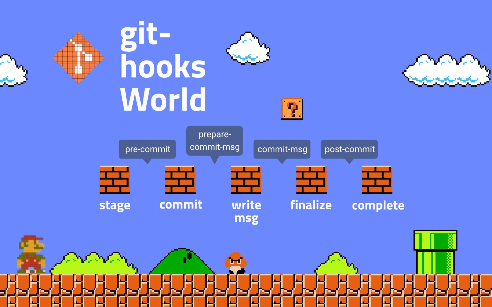

#### lint, 좋긴 한데 지속적으로 쓰긴 까다로워!

프론트엔드 개발자들은 코드 스타일 유지를 위해 여러 `lint` 툴을 사용합니다. 저는 <a href="https://eslint.org/" target="_blank">eslint</a> 에 `airbnb` 설정을 붙여 쓰는 편인데요.
**(참고: <a href="https://github.com/ParkSB/javascript-style-guide" target="_blank">Airbnb JavaScript 스타일 가이드 한글 번역</a>)**
`lint` 자체는 좋지만 **마구잡이로 사용하면 `git` 히스토리가 엉망이 된다**는 문제가 있죠.

한창 개발 중인 프로젝트에 `eslint`를 설치해 전체 파일에 적용했다 칩시다. 세미콜론, 쉼표 같은 자잘한 경고부터 <a href="https://eslint.org/docs/rules/no-undef" target="_blank">no-undef</a> 같은 심각한 에러까지 수정 사항이 여기저기서 뿜뿜 튀어나올 겁니다.
이때 `lint`가 시키는 대로 마구 수정을 하면 개발 중이던 이슈와는 상관 없는 파일들까지 죄다 갈아엎어지겠죠?
그럼 어쩔 수 없이 `git add -A` 같은 광역 명령어를 치고 '`lint` 수정' 같은 무의미한 커밋을 날려야 합니다. 보기 좋은 상황은 아니에요.

프로젝트가 협업 중이라면 `lint` 문제는 더 까다로워집니다. 철수는 커밋할 때마다 꼬박꼬박 `lint`를 적용하는 반면, 영수는 가끔 기억이 날 때만 `lint`를 적용합니다.
그러면 쓸데없는 행이나 스페이스 담긴 코드가 저장소에 올라가겠죠. 나중에 영수가 작업한 파일을 철수가 작업하게 되면 철수는 순수한 변경 사항 외에 `lint`가 잡아내는 에러까지 추가로 커밋해야 합니다.
히스토리의 품질은 떨어지고 철수의 스트레스는 치솟겠죠. *(아는 강사님 중 한 분은 리팩토링 안하고 커밋하는 동료 때문에 진지하게 말싸움도 했다고...)*


#### git과 lint를 하나로! lint-staged

이런 불편함을 해결하고자 등장한 도구가 [lint-staged](https://github.com/okonet/lint-staged) 입니다. 이름 그대로 `git`에 `staged` 된 파일만 `lint` 해주는 녀석이에요.
어떻게 그럴 수 있냐고요? <a href="https://git-scm.com/book/ko/v2/Git%EB%A7%9E%EC%B6%A4-Git-Hooks" target="_blank">git hook</a>이라는 기능을 이용하면 가능합니다.

##### git hook? 처음 듣는데요

여러분의 이해를 돕기 위해 마리오를 초빙해 보았습니다. 배관공에서 개발자로 전업한 마리오는 처음으로 커밋을 하게 되는데,
그 과정을 낱낱이 뜯어보니 스테이징, 커밋, 메시지 작성 등등 무려 다섯 단계의 이벤트를 지나야 한다는 걸 볼 수 있었죠.

이처럼 `git`에서 어떤 이벤트가 생겼을 때, 우리가 원하는 스크립트를 끼워넣도록 이벤트 사이에 갈고리(hook)를 걸어주는 것이 바로 `git hook`입니다.
훅은 여러 종류가 있지만, 오늘 살펴볼 건 **커밋 워크플로우 훅**이에요.


<p class="caption">커밋 워크플로우 훅을 사용하면 커밋을 할 때마다 반복적으로 해야 하는 일들을 손쉽게 자동화할 수 있습니다.</p>

##### commit workflow hook
>
> `pre-commit` 커밋 메시지를 작성하기 전에 호출됨
>
> `prepare-commit-msg` 커밋 메시지 생성 후 편집기 실행 전에 호출됨
>
> `commit-msg` 커밋 메시지와 관련된 명령을 넣을 때 호출됨
>
> `post-commit` 커밋이 완료되면 호출됨

일단 `git hook` 개념은 여기까지만 설명할게요. 오늘은 `git hook`을 파헤치기보단 `lint-staged` 사용법 위주로 다루도록 하겠습니다.

##### 설치

```shell
# npm
npm install --save-dev lint-staged

# yarn
yarn add --dev lint-staged
```

##### 사용법

```json
// package.json
{
  "scripts": {
    "precommit": "lint-staged"
  },
  "lint-staged" {
    "*.js": [
      "eslint --fix",
      "git add"
    ]
  }
}
```

`package.json` 파일 안에 `npm scripts` 옵션으로 `pre-commit` 훅을 호출합니다. 커밋 메시지 작성 전에 `lint-staged` 를 작동시키라는 뜻입니다.
그러면 그 아래에 `lint-staged` 옵션 안에 미리 정의해 둔 규칙이 작동하게 되는 식이지요. 참 쉽죠?

다음에는 `lint-staged` 로 무엇을 작동시킬지를 보겠습니다. 먼저 대상 파일을 정하고, 조건에 맞는 파일이 커밋될 때 무슨 명령어를 실행시킬지를 차례로 작성하면 되는데요.
이때 파일 확장자 앞에 어떤 옵션을 붙이느냐에 따라 `lint-staged` 가 찾는 파일의 범위가 결정됩니다.

```json
{
  // 프로젝트 내의 전체 .js 파일
  "*.js": "eslint",
  // 프로젝트 내의 전체 .js 파일 (디렉터리 내부의 파일까지 모두)
  "**/*.js": "eslint",
  // src 디렉터리 내의 전체 .js 파일
  "src/*.js": "eslint",
  // src 디렉터리 내의 전체 .js 파일 (디렉터리 내부의 파일까지 모두)
  "src/**/*.js": "eslint",
}
```

이렇게 파일의 범위를 정해두면 조건에 맞는 파일이 커밋될 때 `lint-staged`가 작동하며 위에서 정의한 명령어(`"eslint --fix", "git add"`)를 차례로 실행해 줍니다.
그러면 사람이 일일이 신경 쓸 필요 없이 커밋을 할 때마다 코드가 정리되니까 일관된 스타일을 유지할 수 있겠죠?

만일 커밋하려는 파일에 `eslint` 가 허용하지 않는 에러가 있으면 커밋이 거부되기 때문에, 저장소 코드의 품질을 지키는 데에도 아주 유용합니다.

#### Next?

`lint-staged`와 짝꿍으로 붙어 다니는 `husky`라는 도구가 있습니다. `npm` 환경에서 `git hook`을 전문으로 다루는 매니저인데요.
다음 글에서는 `husky`로 `git hook` 을 컨트롤하는 법을 다뤄보도록 하겠습니다.
