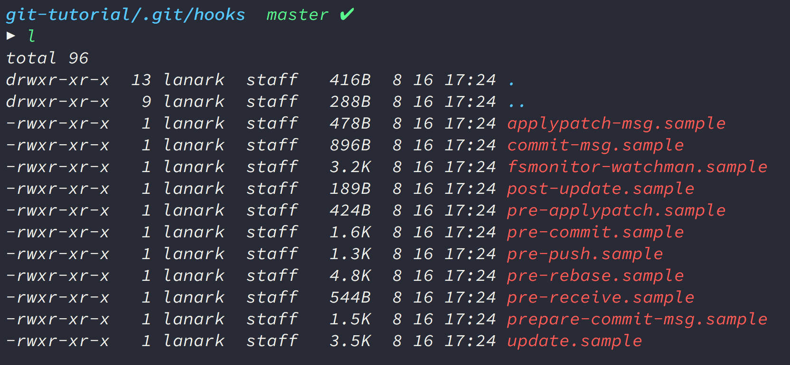

#### 들어가며

<a href="https://github.com/typicode/husky" target="_blank">husky</a>는 프론트엔드 개발 환경에서
<a href="https://git-scm.com/book/ko/v2/Git%EB%A7%9E%EC%B6%A4-Git-Hooks" target="_blank">git hook</a>을 손쉽게 제어하도록 도와주는 매니저입니다.
`git hook`은 말 그대로 갈고리 같은 건데요. `git`을 쓰다가 특정 이벤트(커밋할 때, 푸시할 때 등등)가 벌어졌을 때, 그 순간에 '갈고리'를 걸어서 특정 스크립트가 실행되도록 도와주는 게 `git hook`입니다.

물론 `husky`를 쓰지 않더라도 `git hook`을 설정할 수 있는 공식적인 방법은 따로 있습니다. `.git/hooks` 폴더에 들어가서 스크립트를 작성하면 되는 건데요.



폴더 안으로 들어가 보면, `git` 개발진이 마련해 둔 공식 스크립트 샘플이 담겨있는 걸 볼 수 있습니다. 저기서 `.sample` 확장자를 걷어내고 커스터마이징을 하면 `hook`을 쓸 수 있습니다.

예를 들어 `pre-commit`은 커밋이 만들어지기 전에 호출되고, `prepare-commit-msg`는 커밋이 만들어지고 `git`이 커밋 메시지를 만든 뒤 사용자에게 전달하기 전에 호출되는 `hook`입니다.

`pre-commit`은 파일을 커밋하기 전에 코드 스타일을 정돈하거나 이미지를 최적화하는 등 파일을 전처리하고 싶을 때 사용하는 편이고
`prepare-commit-msg`는 커밋 메시지를 원하는 스타일로 가공하고 싶을 때 주로 사용합니다.


저 파일들을 직접 수정해서 써도 상관은 없지만, `.git/hooks` 폴더 안에 스크립트 파일을 넣게 되면 그 파일은 `git`으로 기록되지 않아서 따로 관리해야 한다는 단점이 있습니다.
또 `git hook`으로 `npm scripts`를 제어하고 싶을 때, 예컨대 `npm test` 라든지 저번 시간에 소개해드린 `lint-staged`등의 명령어를 써야 한다면 스크립트를 작성하는 게 번거로울 수도 있습니다.

`husky`는 굳이 `.git/hooks` 폴더를 건드리지 않고도 `git hook` 스크립트를 제어할 수 있게 도와줍니다.

##### 설치

```bash
# npm
npm install husky@next --save-dev

# yarn
yarn add --dev husky@next
```

##### 사용법

```json
// package.json
{
  "husky": {
    "hooks": {
      "pre-commit": "npm test",
      "pre-push": "npm test",
      "...": "..."
    }
  }
}
```

이게 끝입니다. 참 쉽죠? `git hook`으로 `npm scripts`를 다룰 때는 그냥 이렇게만 하면 충분합니다.

하지만 `git hook`을 `npm scripts` 쓰는 데에만 사용하진 않죠. <a href="http://woowabros.github.io/" target="_blank">우아한 형제들 블로그</a>에서 올려 주신
<a href="http://woowabros.github.io/tools/2017/07/12/git_hook.html" target="_blank">훅으로 Git에 훅 들어가기</a> 같은 글을 보면,
**프로젝트에 이미지를 추가하고 커밋하면 자동으로 이미지를 최적화 해주는 스크립트**를 소개해주고 있습니다.
또는 **이슈 기반 버전 관리**를 할 때, 브랜치에 적어 놓은 이슈 번호를 자동으로 긁어와 커밋 메시지에 추가해주는 스크립트 같은 것도 만들 수가 있죠.
이런 복잡한 명령들은 `husky`에 그냥 입력한다고 작동시킬 수는 없겠죠. 따로 스크립트를 작성하는 편이 나을 겁니다.

##### husky와 내가 만든 스크립트를 동시에 쓰려면?

이렇게 `husky`랑 내가 작성한 스크립트를 동시에 쓰고 싶다면 어떻게 해야 될까요? `husky`는 `husky`대로 두고, 스크립트는 `.git/hooks` 폴더에 넣으면 될까요?
하지만 `husky`를 설치한 뒤에 `.git/hooks` 폴더를 보면 그러기 힘들다는 걸 알 수 있습니다.


`husky`가 이미 스크립트를 자동으로 추가해 놓았기 때문인데요. 파일을 열어보면 모든 `hook`이 `husky`를 실행하도록 설정되어 있다는 걸 알 수 있습니다.


<p class="caption">husky를 설치하면 자동으로 모든 hook에 husky를 실행하라는 스크립트가 작성됩니다.</p>

그럼 `husky`를 쓰면 스크립트 파일로 `git hook`을 쓸 수는 없는 건가요? 그건 아닙니다.
<a href="https://github.com/typicode/husky/blob/dev/DOCS.md" target="_blank">husky 공식 문서</a>를 보면 `husky`로 스크립트 파일을 호출하는 방법을 알려주고 있습니다.

```json
// package.json
{
  "husky": {
    "hooks": {
      "commit-msg": "echo $HUSKY_GIT_PARAMS"
    }
  }
}
```
<br />

`git`은 원래 세 가지 인자(`argument`)를 받습니다.

> `commit-msg-file` (커밋 메시지 파일)
>
> `commit-source` (커밋되는 파일)
>
> `sha-1` (커밋 번호)

커밋 메시지 파일과 커밋 소스는 반드시 인자로 들어오죠. 세 번째 인자는 수정하는 커밋일 때 `(commit —amend)`들어옵니다.
모든 `git hook` 스크립트는 저 세 가지 인자의 존재를 가정하고 작성됩니다. 근데 `husky`로 스크립트를 작동시키려면 이 인자들을 `$HUSKY_GIT_PARAMS`를 통해서 받아야 합니다.

```json
// package.json
"husky": {
    "hooks": {
      "pre-commit": "lint-staged && /your/script.sh $HUSKY_GIT_PARAMS"
    }
  }
}
```

이렇게 `husky` 명령문에 `$HUSKY_GIT_PARAMS`를 인자로 명시해주면 `git argument`를 스크립트 파일로 전달할 수 있습니다.

##### 실전 응용: 커밋 메시지에 이슈 넘버를 포함시키는 git hook 만들기

이미지 자동 압축 스크립트는 우아한 형제들 블로그의 <a href="http://woowabros.github.io/tools/2017/07/12/git_hook.html" target="_blank">훅으로 Git에 훅 들어가기</a>를 참조하시면 되구요.
저는 이슈 넘버를 커밋 메시지에 자동으로 포함시키는 스크립트를 소개해드리도록 하겠습니다.

**(참고: <a href="https://mug896.github.io/bash-shell/index.html" target="_blank">Bash Shell Script 가이드 by mug896</a>)**

```bash
// add_issue_number_into_commit.sh

#!/usr/bin/env bash

➀ COMMIT_MSG_FILE=$1

➁ branch_name=`git rev-parse --abbrev-ref HEAD`
➂ issue_number=`echo ${branch_name} | cut -d '-' -f1`
➃ first_line=`head -n1 ${COMMIT_MSG_FILE}`

➄ if [ -z "$first_line" ]; then
    ➅ sed -i ".bak" "1s/^/[#$issue_number] /" COMMIT_MSG_FILE
 fi
```

**➀** 쉘 스크립트 문법에서 `argument`는 그 순서에 따라 `$1, $2, $3...` 으로 구분합니다. 코드 가독성을 높이기 위해 `$1`을 `COMMIT_MSG_FILE` 이라고 다시 명명했습니다.

**➁** 현재 커밋의 브랜치 이름을 가져옵니다. `git rev-parse --abbrev-ref HEAD` 명령어로 나온 결과값을 `branch_name` 이라는 변수에 담는 건데요, 명령어를 하나하나 뜯어보면 이렇습니다.

> `rev-parse` : `git`의 저수준 명령어 중 하나입니다. 찾고자 하는 커밋이나 브랜치의 SHA-1 해시 값을 파싱해줍니다. **(참고: <a href="https://git-scm.com/docs/git-rev-parse" target="_blank">https://git-scm.com/docs/git-rev-parse</a>)**
>
> `—abbrev-ref` : 해시 값 대신 해시가 가리키는 오브젝트의 이름을 찾아줍니다.

전체 명령어를 조합하면 현재 `HEAD`가 가리키는 커밋의 해시 넘버를 가져오고, 그 넘버가 가리키는 브랜치 이름을 가져오라는 뜻이 되겠지요.

**➂** `branch_name`에서 이슈 넘버만 가져옵니다. 이를 위해 쉘 스크립트의 `cut` 명령어를 사용합니다. `cut`은 어떤 문자열에서 원하는 조각만 잘라내는 명령어인데요.

> `-d` : 잘라내고 싶은 기준 패턴을 정하고 싶을 때 사용합니다. 지금의 경우 `-`을 기준으로 문자열을 잘라내겠다는 뜻이 되겠죠.
>
> `-f1` : 잘라낸 문자열 중 첫 번째 조각을 사용하겠다는 뜻입니다. 예를 들어 브랜치 이름이 `1-hello` 라면 `-`을 기준으로 문자열을 `1, hello`로 쪼개고, 그 중 첫번째 조각인 `1`을 `issue_number` 변수에 대입하게 되겠죠.

**➃** 커밋 메시지 파일의 첫 번째 라인을 읽어들입니다. `-n1` 이 첫 번째 라인이라는 뜻은 알아보기 쉽죠?

**➄** 조건문입니다. 커밋 메시지 파일의 첫 번째 파일이 비어 있을 경우, *(머지 커밋이나 수정 커밋이 아닌 새로운 커밋일 경우)* 조건문을 작동시킨다는 뜻입니다.
`-z` 는 문자열이 `null`일 경우 `true`를 반환하는 조건식입니다.

**➅** `sed`: `stream editor` 의 줄임말로 텍스트 파일을 편집하게 해주는 에디터입니다. 유닉스 시절에 개발된 아주아주 오래된 도구죠.
**(참고: <a href="https://mug896.github.io/sed-stream-editor/" target="_blank">SED Stream EDitor 가이드 by mug896</a>)**

> `-i` : 파일의 직접 수정을 가능케 합니다.
>
> `.bak` : mac 환경에서만 필요한 백업 파일 확장자 인자입니다. 리눅스, 윈도우에서는 생략해도 좋습니다.
>
> `1` : 첫 번째 행을 대상으로 한다는 뜻입니다.
>
> `s/.../` : `substitute` 의 약자로 치환 명령어입니다. 첫 줄을 `[#$issue_number]` 로 치환하라는 뜻입니다.
>
> 마지막 인자에는 치환을 시도하는 파일의 이름`(COMMIT_MSG_FILE)`이 들어갑니다.

그리고 잊지 말아야 할 제일 중요한 한 가지! **스크립트 파일을 쓰실 땐 실행 권한을 추가하셔야 해요!** 스크립트를 저장한 디렉터리로 가서 실행 권한 추가 명령어를 넣어 줍시다.

```bash
chmod +x ./your-script.sh
```

이제 브랜치 이름을 `이슈 넘버-이슈 내용` 으로 정해놓기만 해도 커밋을 하면 자동으로 이슈 넘버가 커밋 메시지 맨 앞에 들어가는 모습을 볼 수 있습니다.

##### 실제 사용 예시

설명만으로는 성에 안 차신다고요? 그러면 제가 어떻게 `git hook` 관리를 하는지 스샷으로 보여드리겠습니다.


<p class="caption">이 블로그의 package.json</p>

앞서 말씀드린 대로 저는 `npm scripts`와 커스텀 스크립트를 동시에 사용하고 있습니다.
이미지 파일을 커밋하면 `pre-commit` 단계애서 `image_optimization.sh` 스크립트가 작동하고...


<p class="caption">이미지를 커밋할 경우: image_optimization.sh 스크립트 작동</p>

js 파일을 커밋하면 `lint-staged`가 작동하죠.


<p class="caption">js나 jsx 파일을 커밋할 경우: lint-staged 작동</p>

그리고 커밋이 완료되면, `prepare-commit-msg` 훅이 작동하면서 브랜치 이름**(지금은 '8-husky'죠)**에서 이슈 번호를 가져와 커밋 메시지에 입혀줍니다.


#### 마치며: 왜 커밋에 이슈 번호를 달아야 하죠?

여기에 대한 답은 다음 포스트에서 이어가야 할 것 같네요. 커밋에 이슈 번호를 붙이는 건 **'이슈 기반 버전 관리'**를 하기 위해서입니다.
즉, 프로젝트를 '이슈 작성' - '개발' - '이슈 해결'의 흐름으로 이어간다는 뜻인데요. 개발해야 할 내용을 깃헙 저장소에서 이슈로 발행하고,
로컬에서 그 이슈에 맞추어 개발한 뒤에 이슈가 해결되었음을 다시 깃헙 저장소로 알리는 식입니다. 이렇게 하면 개발자의 작업 목적을 분명하게 할 수 있고,
프로젝트의 진척 상황을 손쉽게 관리할 수 있다는 장점이 있습니다. 아무튼 여기에 대해서는 다음 포스트에서 자세히 설명드리도록 하겠습니다. 또 만나요~
