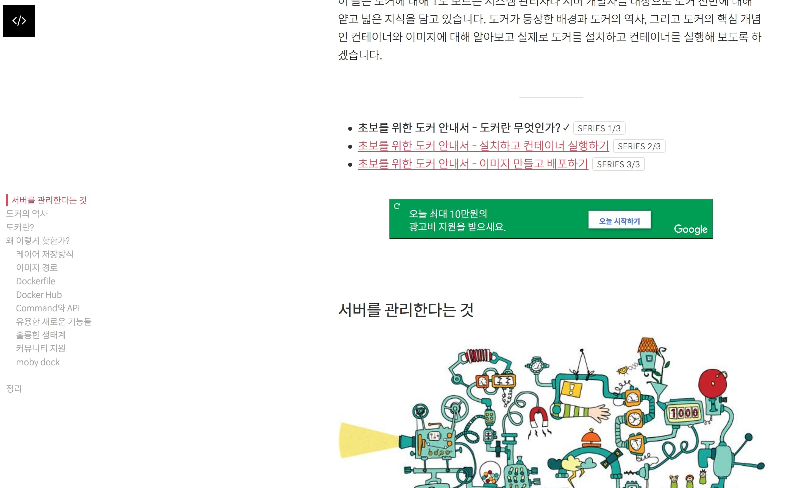

#### 바쁜 현대인들을 위한 목록 요약

######기초 체력 기르기

<a href="#egoing">① 생활코딩 - Coding Everybody</a>

<a href="#programmers">② 프로그래머스</a>

<a href="#monkey">③ 초보몽키의 개발공부로그</a>

###### 트렌디한 소식 접하기

<a href="#gaerae">④ 개발자스럽다</a>

###### 더 깊이 알고 싶다면

<a href="#baek">⑤ 백선기 님의 미디엄 블로그</a>

<a href="#zero-cho">⑥ ZeroCho Blog</a>

<a href="#tech-ssut">⑦ tech.ssut</a>

<a href="#django">⑧ Django 자습 - 핀코인</a>

<a href="#subicura">⑨ 서비큐라 기술 블로그</a>

###### 유명 기업 블로그들

<a href="#companies">⑩ 리디북스, 우아한 형제들, 스포카 기술 블로그</a>

 

#### 들어가며

개발자로서 성장하는 데 있어서 좋은 블로그를 구독하는 건 너무너무 중요한 일이죠. 저도 튼실한 주니어 개발자가 되기 위해 여러 블로그를 찾아다니곤 했는데요.
그 중 제가 꾸준히 참고하는 블로그 열 군데를 골라봤습니다. 유용한 서비스나 유튜브 채널까지 추가하면 10개가 넘어갈 것 같지만 ㅎㅎ... 아무튼 시작해보겠습니다.

 

######기초 체력 기르기

**"아무것도 모른다! 처음의 처음으로 개발을 시작한다!"** 라면 아래 세 가지 사이트는 꼭 둘러보시길 바랍니다.

<h5 id="egoing">① 생활코딩 - Coding Everybody</h5>

사이트 주소: <a href="https://opentutorials.org/course/1" target="_blank" rel="noopener noreferrer">https://opentutorials.org/course/1</a>

유튜브 주소: <a href="https://www.youtube.com/user/egoing2/featured" target="_blank" rel="noopener noreferrer">https://www.youtube.com/user/egoing2/featured</a>

페이스북 그룹: <a href="https://www.facebook.com/groups/codingeverybody" target="_blank" rel="noopener noreferrer">https://www.facebook.com/groups/codingeverybody</a>

슬로건: **일반인들에게 프로그래밍을 알려주는 무료 온라인, 오프라인 수업**

추천하는 이유: *"요즘 코딩이 대세라던데, 나도 공부해볼까?"* 혹은 *"개발자가 되고 싶은데 덜컥 시작하긴 겁나고... 적성에 맞을지 알아볼 순 없을까?"*
같은 고민을 하시는 분들이 **아무런 진입 장벽 없이 편안하게 '개발의 맛'을 보실 수 있는 곳**입니다.
핵심 컨텐츠는 HTML, CSS부터 시작하는 기초 웹 어플리케이션 개발 강좌들인데, 차츰차츰 Node.js 개발 쪽으로도 범위를 넓혀가고 있습니다.

뭐니뭐니해도 생활코딩의 최고 매력 포인트는 **심야 라디오 DJ 같은 꿀보이스에 너무나 친절한 마음씨로 우리를 가르쳐주시는 이고잉 강사님**이시죠. (ㅜㅠ)
강의 중간중간 "지금은 다 이해하지 못하셔도 괜찮습니다~" 라든지 "여러분은 도전을 시작하신 것만으로 성공하신 겁니다!" 등등 힐링 대사를 마구 날려주셔서
왕초보 시절에도 용기를 갖고 공부할 수 있었답니다.

 

<h5 id="programmers">② 프로그래머스</h5>

사이트 주소: <a href="https://programmers.co.kr/" target="_blank" rel="noopener noreferrer">https://programmers.co.kr</a>

슬로건: **동영상과 실습으로 구성된 최고의 프로그래밍 강의를 만나세요.**

추천하는 이유: 대중적인 언어들(자바, 파이썬, 자바스크립트 등)의 기초 동영상 강의를 무료로 시청할 수 있습니다.
생활코딩이 웹 개발에 초점을 맞추고 있다면 프로그래머스는 프로그래밍 언어 강의가 주를 이루고 있어서 자신의 관심사를 파악하기 좋을 것 같습니다.
최근엔 리액트 네이티브나 블록체인 같은 최신 기술 강의들도 많이 올라오고 있습니다.

프로그래머스는 **알고리즘 테스트를 체계적으로 운영하는 곳**으로도 유명합니다. 언어별, 레벨별로 테스트를 볼 수도 있고 **카카오 코딩 테스트 기출 문제**도 확인할 수 있답니다!
(저를 비롯해) 개발자 취업을 준비하시는 분들께 알고리즘 공부는 필수죠! 수시로 참고하시면 좋을 것 같습니다.

카카오 프렌즈와 함께하는 지옥의 정렬 알고리즘

 

<h5 id="monkey">③ 초보몽키의 개발공부로그</h5>

사이트 주소: <a href="https://wayhome25.github.io/til/2017/08/14/TIL-for-6-months/" target="_blank" rel="noopener noreferrer">
https://wayhome25.github.io/til/2017/08/14/TIL-for-6-months/</a>

핵심 컨텐츠: **개발자 준비생의 TIL(Today I Learned) 포스팅. 워낙 꼼꼼하게 블로그를 채우셔서 결국 취업에도 성공하셨다는 해피엔딩이...!**

이번 블로그는 메인 페이지가 아니라 "6개월간의 TIL 회고 (꾸준히 하면 좋은 일이 생긴다)" 라는 포스트를 사이트 주소로 걸어보았는데요.
그만큼 저 페이지를 읽어보는 게 너무 중요하다는 생각이 들었습니다. 개발자로 커리어 전환을 결심하시고 매일 공부한 내용을 꾸준히 기록하셨더라구요.
개발자를 꿈꾸시는 분들 모두에게 큰 귀감이 된다는 생각이 들었습니다. 저도 기운이 없을 때마다 가끔씩 들어오면서 "열심히 해야지..." 하고 각오를 다잡게 되는 곳이랍니다.

사실상 팔만대장경에 버금가는 TIL...

 

###### 트렌디한 소식 접하기

최신 뉴스에 민감한 건 개발자의 습성이자 의무죠. 퀄리티 좋은 소식을 받아볼 수 있는 사이트를 소개합니다.

<h5 id="gaerae">④ 개발자스럽다</h5>

사이트 주소: <a href="https://gaerae.com" target="_blank" rel="noopener noreferrer">https://gaerae.com</a>

블로그 주소: <a href="https://blog.gaerae.com" target="_blank" rel="noopener noreferrer">https://blog.gaerae.com</a>

페이스북 페이지: <a href="https://www.facebook.com/gaeraecom" target="_blank" rel="noopener noreferrer">https://www.facebook.com/gaeraecom</a>

트위터 주소: <a href="https://twitter.com/gaeraecom" target="_blank" rel="noopener noreferrer">https://twitter.com/gaeraecom</a>

슬로건: **기술 정보를 찾고 분류하며 가치를 더하여 공유하려고 노력합니다.**

개발 관련 포스팅을 다양한 루트에서 큐레이팅해서 올려주시는 곳입니다. 페이스북, 트위터, 유튜브, 블로거 등등 엄청나게 다양한 플랫폼을 동시에 운영하고 있어서
자주 쓰시는 플랫폼 쪽으로 구독하시면 유용하실 겁니다. 위에 링크한 루트 말고도 공식 사이트에 들어가 보시면 더 많은 플랫폼을 둘러보실 수 있어요.

블로그 메인 화면

 

###### 더 깊이 알고 싶다면

공부 중인 언어를 더 깊이 알고 싶을 때, 고수의 블로그를 찾아나서게 되는데요. 파이썬, 자바스크립트의 핵심을 파헤치거나 개발 전반에 걸쳐 깊은 혜안을 보여주시는 분들을 소개하도록 하겠습니다.

<h5 id="baek">⑤ 백선기 님의 미디엄 블로그</h5>

사이트 주소: <a href="https://engineering.huiseoul.com/@sunki.baek" target="_blank" rel="noopener noreferrer">https://engineering.huiseoul.com/@sunki.baek</a>

핵심 컨텐츠: **"자바스크립트는 어떻게 작동하는가"** 시리즈

<a href="http://www.huiseoul.com" target="_blank" rel="noopener noreferrer">Huiseoul</a>의 엔지니어로 자바스크립트, 타입스크립트, SQL 등을 주로 다루시는 분입니다.

꼭 읽어보셔야 할 글로는 <a href="https://blog.sessionstack.com/@zlatkov" target="_blank" rel="noopener noreferrer">Alexander Zlatkov</a>의 글을 번역한

**"자바스크립트는 어떻게 작동하는가"** 시리즈가 있습니다. 자바스크립트의 핵심 작동 원리를 명쾌하게 설명한 포스팅입니다.

 

<h5 id="zero-cho">⑥ ZeroCho Blog</h5>

사이트 주소: <a href="https://www.zerocho.com" target="_blank" rel="noopener noreferrer">https://www.zerocho.com</a>

핵심 컨텐츠: **프론트엔드 개발 환경 전반을 다루는 깊이 있는 포스팅**

자바스크립트나 제이쿼리에 대해 구글 검색을 하면 항상 최상단에 올라가 있는 바로 그 블로그, ZeroCho 님의 블로그입니다.
자바스크립트, ES6, 웹팩, 리액트, NoSQL 등등 프론트엔드 개발에 필요한 거의 모든 내용을 총망라하고 있습니다.
저도 리액트를 공부하면서 문지방이 닳도록 들렀던 곳인데요. 최근에는 책도 출간하시고 알고리즘 포스트도 많이 올리고 계십니다.

 

<h5 id="tech-ssut">⑦ tech.ssut</h5>

사이트 주소: <a href="https://tech.ssut.me" target="_blank" rel="noopener noreferrer">https://tech.ssut.me</a>

핵심 컨텐츠: **파이썬 관련 포스팅**

파이썬에 관한 깊이 있는 글들을 번역해두신 블로그입니다. 파이썬뿐만 아니라 https, node 를 다루는 글도 많이 올라와 있습니다.

 

<h5 id="django">⑧ Django 자습 - 핀코인</h5>

사이트 주소: <a href="https://wikidocs.net/book/837" target="_blank" rel="noopener noreferrer">https://wikidocs.net/book/837</a>

핵심 컨텐츠: **django 사용법 A to Z**

파이썬 웹 프레임워크 장고에 대한 모든 것을 종합하고 있는 곳입니다. 자체 컨텐츠도 알차지만 외부 링크로 걸어둔 참고용 블로그도 눈여겨볼 곳이 많습니다.

사이트 중 한 페이지 예시

 

<h5 id="subicura">⑨ 서비큐라 기술 블로그</h5>

사이트 주소: <a href="https://subicura.com" target="_blank" rel="noopener noreferrer">https://subicura.com</a>

핵심 컨텐츠: **Docker, DevOps 관련 포스팅**

**초보를 위한 도커 안내서** 시리즈가 페이스북 좋아요 1천여 개를 받을 정도로 도커에 관해 친절하고 깊이 있게 설명하고 있는 블로그입니다.

덧붙여 **본격 macOS에 개발 환경 구축하기**도 맥으로 개발하시는 분이라면 놓쳐서는 안 될 포스팅이죠.

 

###### 유명 기업 블로그들

개발자 취준생이라면 원티드, 로켓펀치만큼 자주 들락거릴 사이트가 바로 유명 기업들의 기술 블로그일텐데요.
훌륭한 기업 블로그가 많아서 뭘 소개할지 고민하다가 결국 한 번호에 전부 몰아서 (...) 올리기로 했습니다. ㅎㅎ

<h5 id="companies">⑩ 리디북스, 우아한 형제들, 스포카 기술 블로그</h5>

- 리디북스: <a href="http://www.ridicorp.com/blog/" target="_blank" rel="noopener noreferrer">http://www.ridicorp.com/blog/</a>
- 주요 관심사: **서버 관련 해결 사례, UI/UX 개선 사례**

 

리디북스는 우리나라에서 가장 규모가 큰 전자책 서비스 기업이죠. 그러다 보니 전자책 DB를 안정적으로 운영하는 것에 가장 집중하고 있음을 알 수 있었습니다.
웹과 모바일, 리디북스 페이퍼 머신을 위한 UI/UX 디자인을 어떻게 개선하고 있는지도 꾸준히 기록하고 있었구요.
두 가지 목표를 함께 추구하는 모습에서 **'기술력만을 위한 기술력이 아니라 유저에게 무엇을 제공할 것인가를 진지하게 고민하고 있구나'** 라는 인상을 받았습니다.

디자인 개발 사례와 서버 개발 사례가 큰 축으로 전개되는 리디북스 블로그

 

- 우아한 형제들: <a href="http://woowabros.github.io" target="_blank" rel="noopener noreferrer">http://woowabros.github.io</a>
- 주요 관심사: **신입 개발자 양성 후기, 뭔진 잘 모르겠지만 쩔어버리는 기술력 포스팅, 각 멤버들의 회고 포스팅**

 

어느덧 국내 스타트업의 상징이 되어버린 배민! 그래서인지 우아한 형제들 블로그는 요리보고 조리봐도 대단해 보일 뿐인데요.
저는 자바 쪽이 아니어서 지원하기는 어렵겠지만, 우아한 테크 캠프 포스팅이라든지 개발진들의 실패담, 성공담을 나누는 글들에서 많은 영감을 얻는 편이라 자주 보곤 합니다.

앗, 아아... 저는 잘하고 있는 걸까요...

 

- 스포카: <a href="https://spoqa.github.io" target="_blank" rel="noopener noreferrer">https://spoqa.github.io</a>
- 주요 관심사: **오픈 소스, 오픈 소스, 오픈 소스!**

 

이젠 어느 카페를 가도 심심찮게 볼 수 있는 <a href="https://www.dodopoint.com/" target="_blank">도도 포인트</a>를 개발한 회사입니다.
가게마다 일일이 포인트 카드를 출력해서 도장 찍고 관리하던 아날로그 방식에서 벗어나
고객이 핸드폰 번호를 입력하기만 하면 포인트 적립, 고객 관리가 자동으로 이루어지게끔 만들어진 서비스인데요.

그러나 친절하고 샤방샤방한 인터페이스의 뒷면, 기술 블로그에는 오픈 소스의 끝판왕이라고 할 만한 무시무시한 프로젝트가 가득 담겨 있습니다.
그중에서도 최강은 구글의 노토 산스 CJK 폰트를 경량화한 <a href="https://spoqa.github.io/spoqa-han-sans/ko-KR/" target="_blank" rel="noopener noreferrer">스포카 한 산스</a>가 아닐까 싶네요.
**'한글 폰트가 웹에서 쓰기엔 너무 무거우니 직접 서브셋을 만들어버리자!'** 라는 실행력이라니, 엄청나지 않습니까...

뿐만 아니라 일본 시장을 위한 다국어 스크립트도 직접 제작하는 등 스포카 개발자분들의 능력은 정말이지 최고인 듯 싶습니다.

오픈 소스 프로젝트 개발을 적극 장려하는 듯한 스포카

 

#### 마치며

두고두고 참고할 만한 10가지 블로그를 추려낸다는 게 시간이 꽤나 걸리는 작업이었네요. 그래도 마치고 나니 뿌듯합니다.
언젠간 많은 사람이 찾는 양질의 블로그를 키워내고 싶은 한 사람으로서 각오를 새롭게 다지게 되는 계기가 되었습니다.
여러분들도 자기만의 완소 블로그가 있으시다면 널리널리 퍼뜨려주세요~
