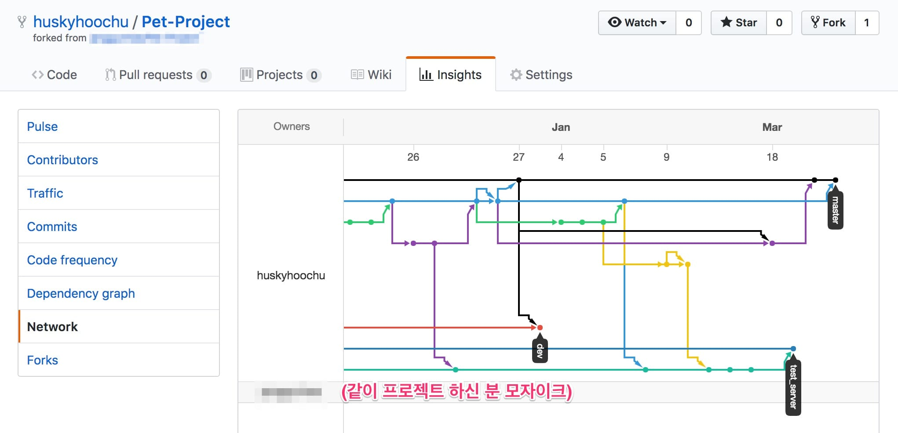
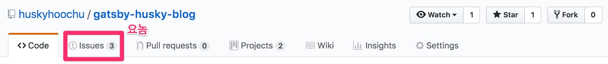
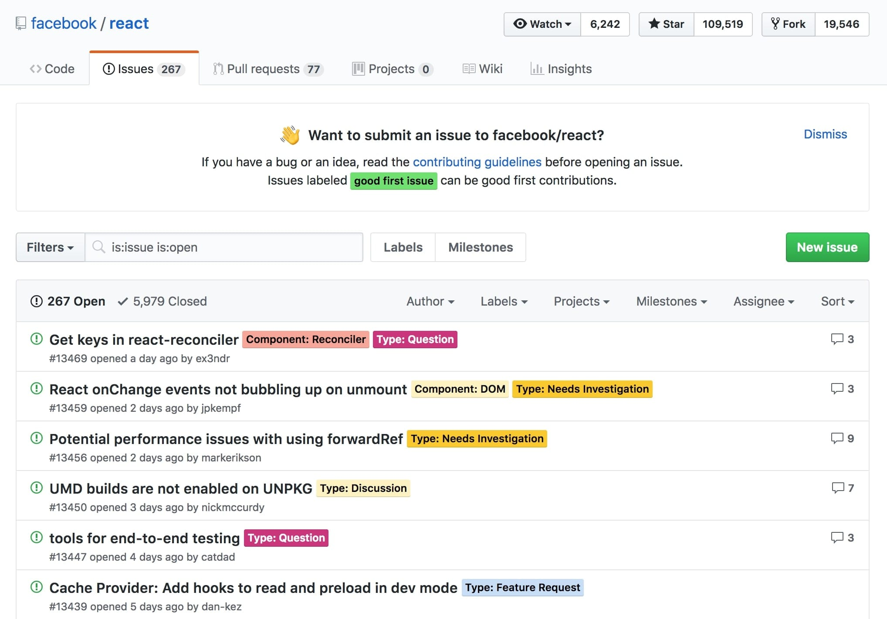
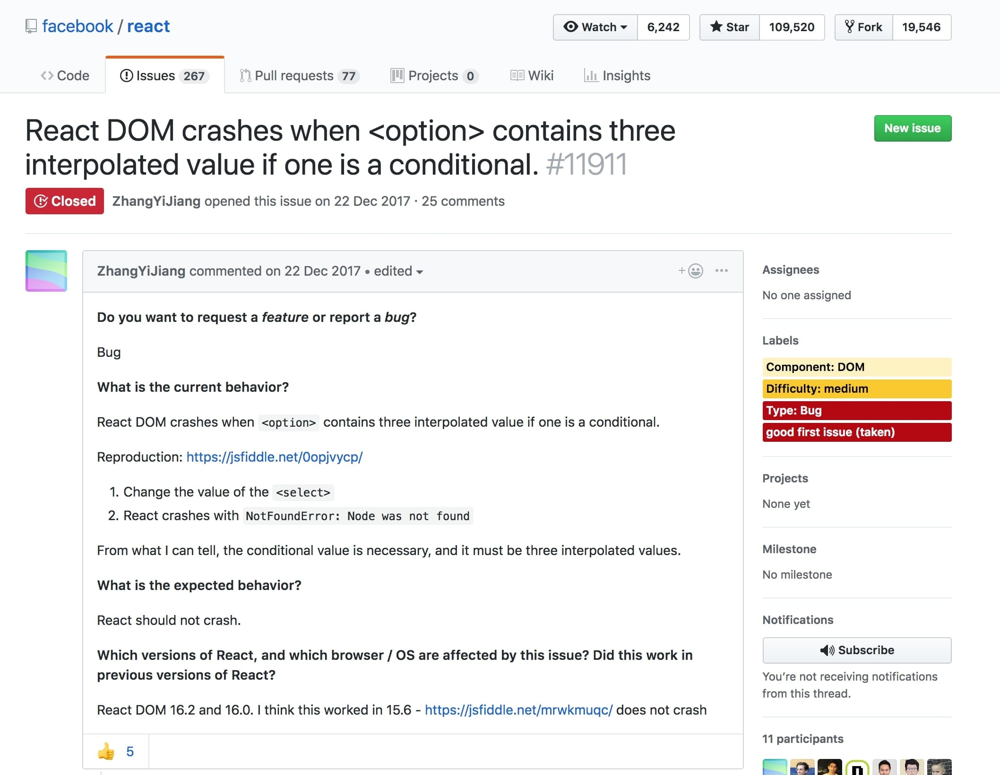
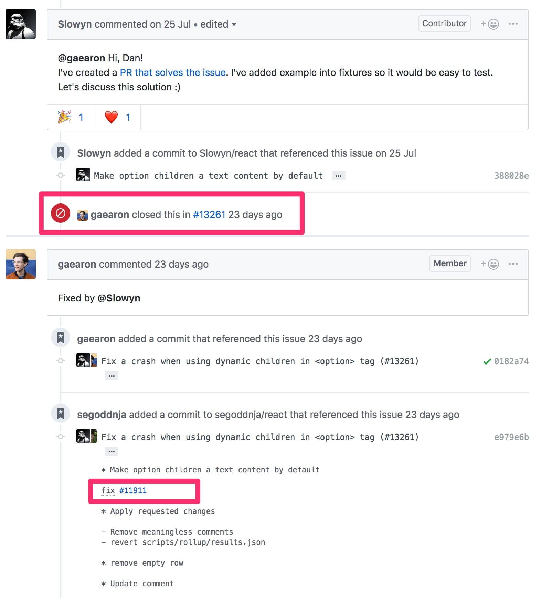

팀을 위한 Git 

<a href="http://www.yes24.com//SearchCorner/Result?domain=ALL&author_yn=Y&query=%bf%a5%b8%b6+%c1%a6%c0%ce+%c8%a3%b1%d7%ba%f3+%bf%fe%bd%ba%c6%ae%ba%f1" target="_blank">엠마 제인 호그빈 웨스트비</a>
 저 / <a href="http://www.yes24.com//SearchCorner/Result?domain=ALL&author_yn=Y&query=%c3%d6%ba%b4%c7%f6" target="_blank">최병현</a> 역

개인과 팀, 프로젝트가 효율적으로 성장하고 발전하는 Git 워크플로우 
 Git은 단순한 빌드 소프트웨어가 아니다. 이 책은 버전관리에서 사람을 우선으로 하는 접근법을 실용적으로 풀어내고, 이를 통해 Git을 중심으로 하여 더 효과적으로 팀 작업을 하는 방법에 대해서도 설명한다.
또한 계획을 세우는 방법을 설명하고, Git 워크플로우를 적용하는 방법도 설명한다. Git 워크플로우는 프로젝트 목표를 완수하는 데 큰 도움이 된다. 팀 내부의 즉각적인 요구에 유연하게 대응하고 팀이 지속적으로 성장할 수 있게 한다.

 

(이 포스트는 한빛미디어의 **⟪팀을 위한 Git⟫** 을 요약 정리하며 만들었습니다. 출판사로부터 소정의 원고료는 *받으면 정말 좋겠네...*⭐)

 

#### 목차

- <a href="#intro">들어가며</a>

- <a href="#philosophy">핵심은 "git"이 아니라 "프로젝트 관리 철학"</a>

- <a href="#question">규칙 좋은 건 알지. 그치만 혼자서 일하다보면 건너뛰기 쉬운걸?</a>

- <a href="#issue-version-control">1인 개발자를 위한 솔루션: github의 이슈 트래커</a>

- <a href="#workflow">이슈 트래커를 이용한 이슈 기반 버전 관리 워크플로</a>

- <a href="#next">마치며: 실전 편 예고</a>

 

<h4 id="intro">들어가며</h4>

저는 개발 경력이 짧습니다. 8월 현재로 치면 1년 남짓이네요. 아직까진 팀으로 개발한 경험보다 1인 프로젝트를 맡은 경험이 더 많습니다.
저장소를 혼자서만 써 버릇하니까 `git` 관리가 자연스레 소홀해지더라구요. 이런 상황이 늘 불만이었습니다. `master` 브랜치에서 모든 작업을 해치우는 짓까지 하진 않았지만
**"내가 쓰는 커밋 메시지가 제대로 된 건가?" "브랜치 관리는 대체 어떻게 해야 되지?" "로그 그래프가 뒤죽박죽인데 이래도 되는 건가?"**
싶은 불안감이 있었습니다.

패스트캠퍼스 시절 팀 프로젝트 저장소 현황. (이게 브랜치야 지하철 노선도야)

그렇게 **"혼자서 개발하더라도 버전 관리를 똑부러지게 할 수 있는 방법은 없을까?"** 하고 고민하던 중, **⟪팀을 위한 Git⟫**을 발견하고 냅다 질렀습니다.

(잠깐 샛길로 빠지자면, 전 개발 도서는 되도록 리디북스로 삽니다. 전자책이니까 종이책보다 싸고, 무게 0g이고,
작업 도중에 참고하고 싶으면 언제든지 컴퓨터로 열어볼 수 있으니까 편해요.)

 

<h5 id="philosophy">핵심은 "git"이 아니라 "프로젝트 관리 철학"</h5>

책 전체를 한 줄로 요약하면 위의 제목과 같지 않을까 싶습니다. 저자의 원칙은 단순합니다. **훌륭한 팀을 만들고 모든 작업의 목적을 분명히 할 것.**
버전 관리 시스템을 쓰는 건 파일을 잘 관리하기 위한 기술적 선택일뿐 아니라 팀원들과의 효율적인 의사 소통을 위한 정치적 선택이라는 사실을 기억해야 합니다.
어떤 작업을 누가 어느 시점에 했는가, 우리는 처음으로부터 얼마나 멀리 왔는가, 팀의 공동 목표는 무엇인가를 끊임없이 되새기고 나아가기 위해 사용한다는 것이죠.

> *"버전 관리 시스템을 제대로 사용한다는 것은 특정한 방식으로 사고한다는 것을 의미한다... (중략) ...생각을 구조화하고, 기억하고, 공유하는 것.
이 점을 이해하지 못하면 Git 사용은 기껏해야 '마법 주문'을 암기해 사용하는 것에 불과하다."*
>
> *—마크 애트우드(HP 오픈소스 규약 이사), 추천사 중*

**"그럼 혼자서 작업할 때는 버전 관리가 필요 없다는 건가?"** 라고 질문할 수도 있겠습니다. 전 동의하지 않습니다. '1인 팀도 팀은 팀'이죠.
1인 개발을 하는 많은 분들이 느끼실 겁니다. 프로젝트를 시작할 때의 '나'와 끝나갈 때쯤의 '나'는 전혀 다른 사람이라는 걸...

이런 흉폭한 코드를 쓴 게... 나라니...

근데 농담이 아니라 **1인 팀은 항상 '미래의 나'를 멤버로 가정하고 작업해야 합니다.** 우리는 지금 작업한 내용을 반드시 까먹게 되어 있고,
코드가 어떻게 돌아가는지 전부 까먹은 상태에서 프로젝트를 리뷰해야 할 상황은 반드시 찾아오게 돼 있습니다. 면접관 앞에서 포트폴리오를 설명해야 할 때라든지,
혼자 프로젝트를 개발하다가 새로운 멤버를 섭외할 때라든지, 단순히 프로젝트를 마친 뒤 회고를 할 때도 그렇겠죠.
따라서 '미래의 나'가 금방 기억을 되살릴 수 있도록 일관된 원칙에 따라 작업을 저장하는 것, 주석과 문서화를 게을리하지 않는 게 정말 중요합니다.
(오히려 1인 팀이라면, 나중에 어디 가서 물어볼 데도 없다는 사실을 기억하셔야 합니다)

 

<h5 id="question">규칙 좋은 건 알지. 그치만 혼자서 일하다보면 건너뛰기 쉬운걸?</h5>

이것도 맞는 말입니다. 당장 누가 "뭐 이런 사소한 작업 하나하나를 전부 커밋해요?" "병합을 잘못하셔서 브랜치 꼬였잖아요!"
라고 타박하는 것도 아닌데 브랜치 관리를 예쁘게 하고 커밋을 신중하게 정리한다는 게 부담스럽기도 하죠.
저도 혼자 공부하면서 `git`을 일관되게 쓰려고 <a href="https://item4.github.io/2016-11-01/How-to-Write-a-Git-Commit-Message/" target="_blank">Git 커밋 메시지 작성법</a>
같은 포스트도 찾아 보고 했는데요. 글 자체는 좋았지만 영어 사용자에게 맞는 충고가 대부분이어서 크게 와닿지는 않았습니다.
무엇보다 저한테 필요했던 건 자잘한 스킬이 아니라 **거시적인 작업 흐름을 만들어주는 자동화된 시스템**이었거든요.

 

<h5 id="issue-version-control">1인 개발자를 위한 솔루션: github의 이슈 트래커</h5>

제가 찾던 시스템이 이미 github 안에 있었더라구요! 바로 github의 이슈 트래커입니다. (다른 `git` 호스팅 서비스도 모두 가지고 있습니다)
github 저장소를 돌아다니다 보면 `issues`라는 버튼을 한번쯤 보셨을 텐데요.

 

유명한 프로젝트에는 수백 수천 건의 이슈가 쌓여 있기도 하죠. 페이스북의 리액트 저장소를 구경해볼까요?

 

리액트 공식 저장소에는 열려 있는 이슈만 267개, 전체 이슈는 13469개나 되는군요

 

**대체 저 '이슈'가 뭐냐? 말하자면 프로젝트 안에서 벌어질 수 있는 가장 작은 단위의 '사건'이라고 보시면 됩니다.**
오픈 소스 프로젝트에는 수많은 기여자들이 프로그램의 버그나 개선점을 제보하러 찾아오죠.
프로젝트의 관리자에게 질문하거나 요청하고 싶을 때 기여자는 '이슈'를 '오픈'합니다.
오른쪽 위에 커다란 초록색 버튼 'New Issue' 가 보이시나요?

 

11911번째 이슈. 'ZhangYiJiang' 유저의 제보.  
&lt;option&gt; 태그 안에 보간이 3개 들어 있고 그중 하나가 조건문이면 리액트 DOM이 터진다.

 

버튼을 눌러 이슈를 연 기여자는 질문이나 요청을 남기고, 관리자는 나름의 답변을 해주거나 다음 릴리즈 때 해결하겠다는 약속을 하죠.
나중에 문제가 해결되면 관리자는 이슈를 닫습니다.

 

'Slowyn' 기여자가 버그를 해결한 코드를 올리고 'gaearon' 관리자가 이를 승인함. 
<strong>(첫 번째 빨간색 상자)</strong>

 

위의 예시는 누군가 리액트의 버그를 제보하자 다른 기여자가 이를 해결하고 관리자가 최종 승인하는 과정을 담고 있는데요.
우리가 주목해야 할 건 두 번째 빨간색 상자입니다. 커밋 메시지에 `fix #11911` 이라고 적혀 있죠?
커밋 메시지에 이슈 번호를 적어서 저장소에 올리면 github은 그 커밋을 이슈 페이지에 추가해줍니다.
이 기능 덕분에 이슈 페이지에는 버그가 제보되고 해결된 코드의 커밋이 올라온 뒤, 관리자가 코드를 승인하고 이슈를 닫는 과정이
타임라인 형식으로 완벽하게 기록됩니다.

이슈 기반 버전 관리는 github이 제공하는 이슈 트래커를 개발 프로세스의 핵심 축으로 이용하는 겁니다.
**요컨대 이슈를 만들고 해결하는 과정을 혼자서 반복하는 겁니다.
그렇게 하기만 해도 github은 여러분의 프로젝트가 발전되는 과정을 알아서 정리해준다는 뜻이죠.**

 

<h5 id="workflow">이슈 트래커를 이용한 이슈 기반 버전 관리 워크플로</h5>

이제부터는 구체적인 실행 방법을 알아볼 텐데요. 책에 적혀 있는 순서는 다음과 같습니다.

> ① 새로운 이슈를 열고 번호를 확인한다.
>
> ② 로컬 저장소에 새로운 브랜치를 생성한다. 형식은 "이슈 번호-설명".
>
> ③ 이슈에 적어둔 목표를 해결한다. **(오직 이슈에 적힌 내용만 작업한다)**
>
> ④ 작업을 테스트하여 제대로 완료됐는지 확인한다.
>
> ⑤ 수정 사항을 커밋하고 푸시한다. **(github이 커밋을 추적할 수 있도록 커밋 메시지 안에 이슈 번호를 적어야 한다)**
>
> ⑥ 작업이 잘 완료됐다면 작업 브랜치를 메인 브랜치에 병합(`merge`)한다.
>
> ⑦ 이슈에 모든 내용이 잘 기록됐는지 확인하고 이슈를 닫는다.

처음 보면 너무 복잡하다고 느껴질 수도 있는데요. 익숙해지고 나면 '진작부터 쓸걸!' 싶을 정도로 쓰기 편하실 거에요.

 

<h4 id="next">마치며: 실전 편 예고</h4>

쓰다 보니 포스트가 많이 길어졌네요. 뒷부분부터는 실제로 제가 어떻게 이슈 트래커를 사용하는지 이어가려고 했는데
'실전 편'을 따로 만드는 편이 보시기에 편할 것 같아서 일단은 여기서 줄입니다.
다음 포스트에서 만나요!
