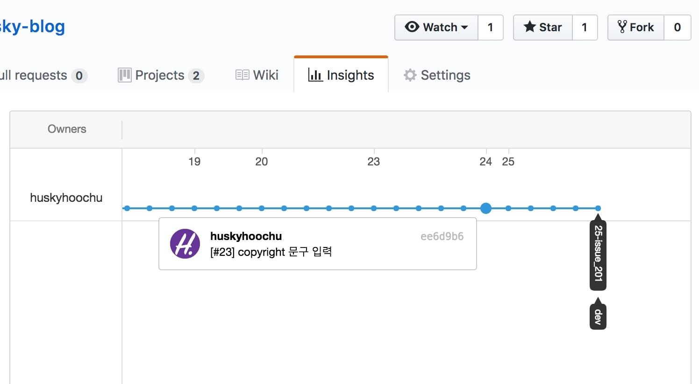

(이 포스트는 한빛미디어의 <a href="http://www.yes24.com/24/Goods/30741673" target="_blank"
rel="noopener noreferrer">&lt;팀을 위한 Git&gt;</a>
을 요약 정리하며 만들었습니다. 출판사로부터 소정의 원고료는 *받으면 정말 좋겠네...*⭐)

<br />

#### 들어가며

안녕하세요 여러분! 지난 포스트에서는 **버전 관리 시스템을 왜 써야 하는지, 1인 팀에서 버전 관리를 효율적으로 하려면 어떻게 해야 하는지**를 알아보았습니다.
버전 관리 시스템을 쓰는 가장 핵심적인 이유는 자신의 작업 결과를 타인과 효율적으로 공유하기 위해서인데, 혼자서 작업하는 1인 팀이라도 '미래의 나'를 위해서
버전 관리는 필수라고 말씀드렸죠. 하지만 1인 팀에서 혼자만의 힘으로 버전 관리를 잘 하는 데에는 한계가 있어요. 이를 해결하기 위해 `git` 호스팅 사이트에서 제공하는
(대표적으로 github) 이슈 트래커를 적극 활용하자! 가 이전 포스트의 핵심 내용이었습니다.

(이전 포스트를 보고 싶으신 분은
<a href="https://www.huskyhoochu.com/issue-based-version-control-101" target="_blank"
rel="noopener noreferrer">github 하나로 1인 개발 워크플로우 완성하기: 이론 편</a>을 확인하세요!)

이번 포스트에서는 제가 허스키후추 블로그를 운영하면서 어떻게 이슈 트래커를 사용하는지 직접 보여드리고자 합니다. 저도
<a href="http://www.yes24.com/24/Goods/30741673" target="_blank" rel="noopener noreferrer">&lt;팀을 위한 Git&gt;</a>
을 읽고 나서 이슈 트래커를 쓰기 시작해서 아직 이슈가 많이 쌓이지는 않았지만 참고하시기에는 충분한 양이 쌓였다고 생각됩니다. 그럼 시작해볼까요?

(저장소 주소: <a href="https://github.com/huskyhoochu/gatsby-husky-blog/tree/dev" target="_blank"
rel="noopener noreferrer">https://github.com/huskyhoochu/gatsby-husky-blog</a>)

<br />

#### 목차

- <a href="#review">복습하기: 이슈 기반 버전 관리 워크플로우</a>

- <a href="#open-issue">① 새로운 이슈를 열자!</a>

- <a href="#local-branch">② 로컬 저장소에 작업 브랜치 생성</a>

- <a href="#solve-problem">③ 목표 해결</a>

- <a href="#test">④ 작업 테스트</a>

- <a href="#commit-push">⑤ 커밋과 푸시</a>

- <a href="#merge-branch">⑥ 메인 브랜치에 병합(merge)</a>

- <a href="#close-issue">⑦ 이슈 닫기</a>

<br />

<h5 id="review">복습하기: 이슈 기반 버전 관리 워크플로우</h5>

이전 포스트 결론 부분에 올렸던 7단계 워크플로우를 먼저 살펴볼까요?

> ① 새로운 이슈를 열고 번호를 확인한다.
>
> ② 로컬 저장소에 새로운 브랜치를 생성한다. 형식은 "이슈 번호-설명".
>
> ③ 이슈에 적어둔 목표를 해결한다. **(오직 이슈에 적힌 내용만 작업한다)**
>
> ④ 작업을 테스트하여 제대로 완료됐는지 확인한다.
>
> ⑤ 수정 사항을 커밋하고 푸시한다. **(github이 커밋을 추적할 수 있도록 커밋 메시지 안에 이슈 번호를 적어야 한다)**
>
> ⑥ 작업이 잘 완료됐다면 작업 브랜치를 메인 브랜치에 병합(`merge`)한다.
>
> ⑦ 이슈에 모든 내용이 잘 기록됐는지 확인하고 이슈를 닫는다.

위의 7단계가 하나의 이슈를 처리하는 한 번의 과정이라고 생각하시면 돼요. 그냥 생각나는 대로 주먹구구식으로 작업을 하고 커밋을 한다면
프로젝트는 똑같이 발전하더라도 이게 어떤 과정으로 만들어져 왔는지 확인하기란 아주 어렵겠죠.
하지만 이슈를 중심으로 작업을 하게 되면 자신의 작업이 차근차근 구조화되는 모습을 볼 수 있습니다.

<br />

<h5 id="open-issue">① 새로운 이슈를 열자!</h5>

먼저 제 블로그 저장소의 이슈 게시판에 들어가보겠습니다.


지금은 3개의 이슈가 열려 있네요. 모두 제가 '이게 필요하겠는걸' 싶을 때 추가해 놓은 것들이에요.
할 일 관리 프로그램의 inbox처럼 생각하시면 됩니다.

이번에 저는 사이트에 copyright 문구를 추가하려고 해요. 먼저 이슈를 오픈하겠습니다.
오른쪽에 있는 'New Issue' 버튼을 클릭해주세요.


그러면 다음과 같은 창이 뜨는데요. 제목 란에는 '페이지에 copyright 기입하기' 라고 작성했습니다.
최소한으로 하려면 제목만 쓰고 submit 버튼을 누르시면 되는데요. 이슈를 좀 더 자세히 분류하려면 오른쪽의 네 가지 옵션을 조정하시면 됩니다.

> **Assignees:** 번역하면 "위탁인" 정도? 특별히 이 이슈를 봐 줬으면 하는 멤버를 호출하는 겁니다. 여러 멤버가 있는 팀에선 필요하지만 1인 팀에선 별 의미가 없죠.
>
> **Labels:** 라벨은 이슈의 종류를 분류해주는 태그와 같습니다. github이 기본으로 제공해주는 것도 있지만 커스텀도 돼요.
>
> **Projects:** 프로젝트는 github이 직접 만들어주는 **칸반 보드**입니다. 이슈에 프로젝트를 지정해주면 이슈가 칸반 보드 안에 하나의 카드로 담기게 되죠.
>
> (칸반이 뭐죠? 알아보려면: <a href="http://brownbears.tistory.com/323" target="_blank" rel="noopener noreferrer">칸반 :: 개인적인 공간 - 불곰 - Tistory</a>)
>
> **Milestone:** 마일스톤은 프로젝트가 도달해야 하는 목표 지점을 정해두는 겁니다. 예를 들어 이번 달에 검색 기능을 배포해야 한다면
"검색 기능 릴리즈" 마일스톤을 만들 수 있겠죠. 이때 오픈하려는 이슈가 검색 기능을 완성하는 데 필요하다면 "검색 기능 릴리즈" 마일스톤을 지정해주면 됩니다.

저는 미리 만들어 둔 'Development' 라벨과 '할 일' 프로젝트를 지정했습니다. 그리고 submit을 누르면...


짠! 이슈가 열렸습니다. 새 이슈는 **23번**이군요. 이슈를 열자마자 밑에 두 가지 이벤트가 추가된 걸 볼 수 있는데요.
제가 라벨과 프로젝트를 지정했던 게 타임라인에 남은 거라고 보시면 됩니다.

<br />

<h5 id="local-branch">② 로컬 저장소에 작업 브랜치 생성</h5>

이제 github을 접고 터미널로 내려가보겠습니다. 바로 작업을 하는 건 아니고, copyright 이슈를 위한 작업 브랜치를 따로 쪼갤 겁니다.


저는 `master` 브랜치에서 분기한 `dev` 브랜치를 메인 브랜치로 쓰고 있습니다. (안전이 최고죠!)
`dev` 브랜치에서 새 작업 브랜치를 만들어보죠.

```bash
git checkout -b 23-copyright
```

> `checkout` : 브랜치를 이동하라는 명령어입니다.
>
> `-b` : 브랜치를 생성하라는 옵션입니다. 즉 새로운 브랜치를 생성하자마자 그리로 이동하라는 뜻인 거죠.
>
> `23-copyright` : 생성하려는 브랜치 이름입니다. 저는 "이슈 번호-이슈 내용" 의 형식으로 적었습니다. 왜인지는 이따가 설명하겠습니다.

그리고 새 작업 브랜치를 원격 저장소로 푸시하겠습니다.

```bash
git push --set-upstream origin 23-copyright
```

> `--set-upstream` : 쉽게 말해 로컬 브랜치와 원격 브랜치를 연결하라는 옵션입니다.
>
> `origin` : 원격 저장소 이름입니다.

<br />

<h5 id="solve-problem">③ 목표 해결</h5>

작업 브랜치도 만들었으니 이제 진짜 작업을 해 보겠습니다. 제가 copyright 문구를 넣으려는 곳은 사이드바 하단입니다.


뚝딱뚝딱... 제가 코드를 어떻게 짰는지는 저장소를 구경하시면 쉽게 보실 수 있습니당...


금세 완성했네요.

<br />

<h5 id="test">④ 작업 테스트</h5>

제 블로그는 정적 사이트고, 사용자와 상호작용하며 데이터를 주고받는 부분이 없어서 거창한 유닛 테스트까지는 하지 않습니다.
`lint`를 체크하고 `build`가 잘 되는지를 보기만 하는데요. 저는
<a href="https://www.jetbrains.com/webstorm/" target="_blank" rel="noopener noreferrer">WebStorm</a>
IDE를 쓰고 있어서 코딩하는 동안 `lint` 체크를 실시간으로 받습니다.
그리고 `git hook`을 통해 커밋을 할 때 `lint` 체크를 자동으로 한번 더 받고 있습니다. 그래서 이 부분은 패스하도록 하겠습니다.

(`git hook`이 뭐죠? 알아보려면: <a href="https://www.huskyhoochu.com/npm-husky-the-git-hook-manager"
target="_blank" rel="noopener noreferrer">husky로 손쉽게 git hook 관리하기</a>
를 읽어주세요!)

그런데 한 가지, 작업하면서 알게 된 사실이 하나 있는데요. **`target="_blank"`를 이용해 외부 링크를 만들면 피싱 위험이 있다고 해요.**
(참고: <a href="https://blog.coderifleman.com/2017/05/30/tabnabbing_attack_and_noopener/"
target="_blank" rel="noopener noreferrer">Tabnabbing 공격과 rel=noopener 속성 | Coderifleman's blog</a>)
그래서 앵커 태그 안에 `rel="noopener noreferrer"` 속성을 달아줘야 한다고 하네요.

<br />

<h5 id="commit-push">⑤ 커밋과 푸시</h5>

작업을 마쳤으니 커밋과 푸시를 할 차례입니다.


변경된 모든 파일을 `staging` 한 다음 커밋 명령을 내립니다. 그러면...


커밋 메시지 창이 나옵니다. 이때 `#이슈 번호` 형식으로 커밋 메시지에 입력을 하면 github이 이슈 번호를 읽어들이게 됩니다.

제가 작업에 앞서 브랜치 이름을 "이슈 번호-이슈 내용"으로 만들었던 거 기억 하시나요? 그 이유가 바로 여기서 나오는데요.
커밋 메시지 제목에 붙어 있는 `[#23]`은 제가 손으로 친 게 아니라 `git hook`이 브랜치 이름을 읽어들여서 자동으로 붙여 준 문구입니다.
어떻게 그게 가능하냐구요? <a href="https://www.huskyhoochu.com/npm-husky-the-git-hook-manager"
target="_blank" rel="noopener noreferrer">husky로 손쉽게 git hook 관리하기</a> 를 읽어보시면 됩니다. 😙


이렇게 푸시까지 마쳤습니다.

<br />

<h5 id="merge-branch">⑥ 메인 브랜치에 병합(merge)</h5>

자, 앞서서 제가 작업 테스트를 건너 뛴 것처럼 말씀드리긴 했지만 실은 그렇지 않습니다. 저는
<a href="https://travis-ci.org" target="_blank" rel="noopener noreferrer">Travis CI</a>
라는 지속적 통합 툴을 이용해서 테스트를 자동화하고 있는데요. **지속적 통합**이라니 그건 또 뭣이냐? 정말 압축해서 한 문장으로 요약해보면
**"테스트와 빌드, 배포를 자동화함으로써 개발자의 코드 변경 사항을 정기적으로 통합해가는 개발 방식"**입니다.
지속적 통합에 관한 문서는 조금만 검색해 보셔도 많이 나오니까 찾아보시길 바라구요.
AWS가 지속적 통합을 정의 내린 문서가 괜찮아 보여서 이것만 링크를 걸도록 하겠습니다.
(<a href="https://aws.amazon.com/ko/devops/continuous-integration/"
target="_blank" rel="noopener noreferrer">지속적 통합이란 무엇입니까? - Amazon AWS</a>)

본론으로 돌아와서, 변경 사항을 푸시하면 두 가지 변화가 일어나는데요. 첫째로 Travis CI가 제 커밋을 테스트하기 시작합니다.


무엇을 테스트하느냐? 그건 제 저장소 최상단에 있는 `.travis.yml` 파일에 정의되어 있습니다.
(더 이상의 Travis CI 관련 이야기는 글의 범위를 벗어나므로 줄이겠습니다)


둘째로 아까 저희가 오픈한 23번 이슈에 가 보면, 푸시한 커밋이 타임라인에 기록되어 있는 걸 볼 수 있습니다.
커밋 메시지에 이슈 번호를 입력해두었기 때문에 github이 이 커밋을 레퍼런스로 걸어둔 것입니다.
커밋 메시지에 입력한 이슈 번호를 github이 파란색 링크 버튼으로 만들어 준 거 보이시나요?


이렇게 **각 이슈 페이지마다 나의 작업 결과를 타임라인 형식으로 묶어내는 게 이슈 기반 버전 관리의 핵심**입니다.

자, 그 사이에 Travis CI가 테스트를 완료했군요. 두 가지 운영체제, 두 가지 node 버전에서 모두 `build`를 성공했습니다.


테스트를 통해 저희의 커밋이 안전하다는 것이 증명되었으니, 이제 `23-copyright` 브랜치를 `dev` 브랜치에 병합(`merge`)하도록 하겠습니다.


이게 제가 브랜치를 병합하는 전체 과정인데요. 두 가지 생소한 명령어가 보이실 겁니다.

> `git rebase dev` : `rebase` 명령어는 말 그대로 `base`를 다시 쌓는다는 뜻입니다.
현재 브랜치의 커밋 히스토리에 병합할 브랜치의 히스토리를 합쳐서 두 브랜치의 뿌리를 하나로 재정립하는 거죠.
저는 작업 브랜치를 병합 후에 없애버릴 예정이기 때문에 굳이 분기를 만들 필요가 없죠. 그래서 `dev` 브랜치로 `rebase` 했습니다.
>
> (뭔 소리예요? 더 알고 싶다면: <a href="https://git-scm.com/book/ko/v2/Git-%EB%B8%8C%EB%9E%9C%EC%B9%98-Rebase-%ED%95%98%EA%B8%B0"
target="_blank" rel="noopener noreferrer">Git - Rebase 하기</a>)
>
> `git pull --rebase=preserve` : 간단히 말해서 원격 브랜치의 최신 사본을 업데이트 받는 명령어라고 생각하시면 됩니다.

작업 브랜치와 메인 브랜치의 뿌리가 같아졌기 때문에 병합을 하게 되면 `fast-forward`가 일어나죠. 즉 뒤쳐져 있던 메인 브랜치의 `HEAD`만
최신 커밋으로 **전진했다**고 생각하시면 됩니다.

그리고 저는 `git hook`을 이용해서 병합이 끝나면 자동으로 프로젝트를 배포하도록 짜 놓았어요. 배포는 이 시점에서 이루어집니다.

<br />

<h5 id="close-issue">⑦ 이슈 닫기</h5>

이제는 슬슬 copyright 이슈와 브랜치를 정리할 때가 된 것 같습니다. 이슈 페이지 가장 아래쪽에 있는 'Close issue' 버튼을 누르시면 끝입니다.


빨갛게 'Closed'라는 표시가 떠올랐죠.


이렇게 닫힌 이슈 목록에도 올라가고...


프로젝트의 칸반 보드에도 'Done' 항목으로 넘어갔네요.

제 저장소의 이슈 목록을 들어가보면 아시겠지만, 이슈 기반 버전 관리를 한 다음부터는 커밋에도 저절로 체계가 잡히고 누군가 처음 저장소를 방문하더라도
금세 이 프로젝트의 진행 상황을 알아볼 수 있도록 변한 것을 보실 수 있을 거예요. 저 스스로도 이런 시스템 안에서 작업을 하니까 많이 안정감을 느끼게 되었어요.

이제 copyright 관련 모든 작업이 끝났으니, 23번 브랜치를 삭제하도록 하겠습니다.


원격 브랜치와 로컬 브랜치를 한번에 삭제했습니다.



로그 그래프도 일렬로 깔끔하게 이어지고 있습니다. (이 포스트를 쓰는 중에도 다른 작업을 해서 최신 커밋은 좀 더 앞서 있군요)

**이제 진짜 끝!...?**


<p class="caption" style="text-decoration: line-through;">도르마무, 커밋을 가져왔다</p>

<br />

#### 마치며: 지속적 통합(CI)을 놓치지 마세요!

지금까지 github 이슈 트래커로 이슈 기반 버전 관리 하는 법을 알아봤습니다. 쓰고 나니 어마어마하게 길어졌네요!
처음부터 완벽하게 이슈 트래커를 다루지는 못하더라도, 이 글을 보시고 평소에 잘 쓰지 않았던 `git`의 기능을 하나하나 찔러 보는 계기를
가지셨으면 합니다.

처음에 이론 편에서도 말씀드렸듯이 **결국 핵심은 `git`이 아니라 "프로젝트를 어떻게 관리할 것인가?" 하는 방법론을 계속 고민하는 것**이라고 생각하구요.

이외에도 갖가지 설계 철학이나 팀 철학이 있으니 각자 검색해보시길 바랍니다.

오늘 포스트는 여기서 마치구요, 다음에 또 만나요~
