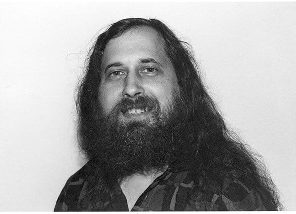
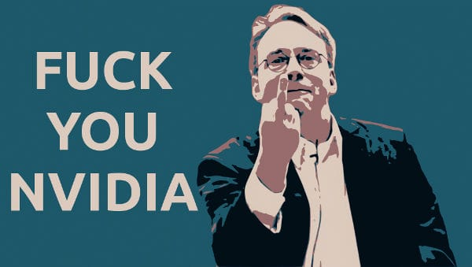

성당과 시장

<a href="http://www.yes24.com//SearchCorner/Result?domain=ALL&author_yn=Y&query=%bf%a1%b8%af+%b7%b9%c0%cc%b8%d5%b5%e5" target="_blank">에릭 레이먼드</a>
저 / <a href="http://www.yes24.com//SearchCorner/Result?domain=ALL&author_yn=Y&query=%c1%a4%c1%f7%c7%d1" target="_blank" rel="noopener noreferrer">정직한</a>,
<a href="http://www.yes24.com//SearchCorner/Result?domain=ALL&author_yn=Y&query=%c3%d6%c1%d8%c8%a3" target="_blank" rel="noopener noreferrer">최준호</a>,
<a href="http://www.yes24.com//SearchCorner/Result?domain=ALL&author_yn=Y&query=%bc%db%c3%a2%c8%c6" target="_blank" rel="noopener noreferrer">송창훈</a>,
<a href="http://www.yes24.com//SearchCorner/Result?domain=ALL&author_yn=Y&query=%c0%cc%b1%e2%b5%bf" target="_blank" rel="noopener noreferrer">이기동</a>,
<a href="http://www.yes24.com//SearchCorner/Result?domain=ALL&author_yn=Y&query=%c0%b1%c1%be%b9%ce" target="_blank" rel="noopener noreferrer">윤종민</a>
역

오픈소스에 관한 철학서!  '보는 눈이 충분하게 많으면, 찾지 못할 버그는 없다'
 이 말은 오픈소스의 철학을 대변하는 이 책의 주제를 단적으로 나타낸다. 여기에는 충분하게 많은 베타 테스터와 공동 개발자가 있으면, 거의 모든 문제는 빠르게 파악될 것이라는 저자의 신념이 드러난다. 
 이 책은 근본적으로 다른 두 가지 개발 방식을 소개한다. 두 가지 방식이란 상업용 소프트웨어의 '성당' 모델과 리눅스 세계의 '시장' 모델이다. 저자는 이 책에서 시장 모델을 적용한 오픈소스 프로젝트인 페치메일을 ...

<strong>"여러분의 영산靈山 백두산을 향해 정중한 예를 올립니다."</strong>
 - 저자 에릭 레이먼드의 한국어판 머리말 중

 

#### 들어가며

최근 오라클이 Oracle JDK 11부터 구독형 라이센스를 적용하겠다고 발표하면서 큰 파장이 일었죠.
세계에서 가장 많이 사용되는 프로그래밍 언어가 유료화되다니!
물론 Open JDK라든지 자바를 무료로 사용할 수 있는 선택지는 여전히 남아 있지만 '자바의 유료화' 선언은 상징적인 충격을 가져다주는 것 같습니다.
(참고: <a href="http://jsonobject.tistory.com/395" target="_blank" rel="noopener noreferrer">Java 유료 논쟁, Oracle JDK와 OpenJDK의 차이 정리</a>)

그런데 이렇게 생각해본 적은 없으신가요? **"프로그래밍에 필요한 대부분의 자원이 무료로 제공되는 상황 자체가 더 이상한 거 아닌가?"**
다른 산업계에서 제품을 만들기 위해 반드시 필요한 도구가 공짜인 경우를 보신 적이 있나요?
예를 들어 목수가 톱을 (영원히) 공짜로 갖는다거나, 화가가 물감과 붓을 공짜로 구할 수 있는 경우가 있나요?
그들을 위한 작업실이 무료인 경우는요? (복지 재단의 엄격한 심사를 거쳐 대여받는 경우를 뺀다면 말이죠)
반면 개발자들은 모든 종류의 프로그래밍 언어를 인터넷에서 공짜로 다운받을 수 있고, 몇만 줄의 코드를 써도 돈을 낼 필요가 없죠.
인터넷에 코드 저장소도 자유롭게 만들 수 있습니다.

(물론 소프트웨어가 'free'하다는 말이 금전적인 의미에서의 'free'를 뜻하는 건 아니지만 이해를 돕기 위해 이렇게 비유해 보았습니다)

오늘날 우리가 프로그래밍 자원을 자유롭게 쓸 수 있게 된 건 컴퓨터 산업 초창기 개발자들의 노력 덕분입니다. 대표적인 인물이
<a href="https://ko.wikipedia.org/wiki/%EB%A6%AC%EC%B2%98%EB%93%9C_%EC%8A%A4%ED%86%A8%EB%A8%BC"
target="_blank" rel="noopener noreferrer">리처드 스톨먼</a>이죠.
그는 대기업이 소프트웨어를 사유화하고 소스 코드를 공개하지 않으려 하는 태도에 반발하여
**"소프트웨어를 사용하고 개작, 배포할 수 있는 권리는 누구에게도 구속되어선 안 된다"**는 '자유 소프트웨어 운동'을 벌입니다.
(참고: <a href="https://www.gnu.org/philosophy/free-sw.ko.html"
target="_blank" rel="noopener noreferrer">자유 소프트웨어란 무엇인가? - GNU 프로젝트 - 자유 소프트웨어 재단 (FSF)</a>)

리처드 스톨먼&nbsp;(슈퍼 히피)

그리고 비슷한 시기에 등장한
<a href="https://ko.wikipedia.org/wiki/%EB%A6%AC%EB%88%85%EC%8A%A4"
target="_blank" rel="noopener noreferrer">리눅스</a>가 엄청난 성공을 거두면서 '자유 소프트웨어' 개념은 전 세계로 퍼져나가게 됩니다.

이 책의 저자인 에릭 레이먼드는 "리눅스의 가장 중요한 특징은 기술적인 것이 아니라 사회적인 것이었다" 라고 말하며
**기존의 상업용 소프트웨어의 개발 전략과 자유 소프트웨어 정신에 기반한 리눅스 개발 전략의 차이**를 '성당 모델'과 '시장 모델'로 나누어 분석하는 글을 씁니다.
이렇게 발표된 <성당과 시장>이라는 글은 컴퓨터 산업계에 커다란 반향을 불러 일으키며 상용 소프트웨어를 판매하던 기업들도 소스 코드를 공개하도록 유도하는 결과를 낳았습니다.
('오픈소스' 는 상용 소프트웨어 기업들이 자유 소프트웨어 운동에 참여하도록 하기 위해 라이선스 조건을 디테일하게 설정한 개념이라고 볼 수 있습니다)

오늘 추천드리려는 ⟪성당과 시장⟫이라는 책은 에릭 레이먼드가 쓴 오픈소스 관련 저작들을 모아서 출간된 것입니다. 그 정신을 기리기 위해서인지 무료로 판매되고 있는데요.
**컴퓨터 산업의 역사와 패러다임을 빠르게 이해하고 싶으신 분**은 일독을 추천드립니다.

<a href="http://www.yes24.com/24/Goods/17942908" target="_blank" rel="noopener noreferrer">yes24</a>,
<a href="https://ridibooks.com/v2/Detail?id=443000262&_s=search&_q=%EC%84%B1%EB%8B%B9%EA%B3%BC%20%EC%8B%9C%EC%9E%A5" target="_blank" rel="noopener noreferrer">리디북스</a>,
<a href="http://digital.kyobobook.co.kr/digital/ebook/ebookDetail.ink?selectedLargeCategory=001&barcode=480D150507200&orderClick=LAG&Kc=" target="_blank" rel="noopener noreferrer">교보문고</a>,
<a href="http://aladin.kr/p/oGWHr" target="_blank" rel="noopener noreferrer">알라딘</a>

 

#### 목차

- <a href="#models">성당에서 시장으로: 소프트웨어 개발의 패러다임이 바뀌다</a>

- <a href="#question">해커들은 자선사업가인가요? 그럴리가요!: 오픈소스의 증여 경제 시스템과 암묵적 금기들</a>

- <a href="#humble">그럼에도 중요한, 겸손의 가치</a>

 

<h5 id="models">성당에서 시장으로: 소프트웨어 개발의 패러다임이 바뀌다</h5>

> *"...운영체제나 이맥스 등 대단히 커다란 도구같이 가장 중요한 소프트웨어는 성당을 건축하듯이,
즉 찬란한 고독 속에서 일하는 몇 명의 도사 프로그래머나 작은 모임의 뛰어난 프로그래머에 의해서 조심스럽게 만들어지고,
때가 되기 전에 발표하는 베타판도 없어야 한다고 생각했던 것이다.
(중략) 대신 리눅스 공동체는 서로 다른 의견과 접근 방법이 난무하는 매우 소란스러운 시장 같았다."*
>
> -본문 중에서

**'성당 모델'은 소수의 뛰어난 프로그래머가 총대를 매고 완벽에 완벽을 기해서 프로그램을 만드는 방식**을 말합니다.
천재 혹은 고액의 연봉을 받는 개발자가 보통 사람들 수천 명보다 뛰어나고, 옳은 결정을 내릴 거란 믿음을 근거로 하고 있죠.
(애플이라거나 애플 같은 그런 느낌...) 소스 코드나 베타 버전도 공개하지 않고 오로지 완벽하게 만들어졌을 때 대중들에게 하사하듯
릴리즈하는 겁니다.

(실은 애플도 스위프트나 맥의 근간이 되는 XNU 커널의 소스코드를 오픈소스로 공개하고 있죠. 참고:
<a href="https://github.com/apple" target="_blank" rel="noopener noreferrer">애플 깃헙 저장소</a>,
<a href="https://opensource.apple.com" target="_blank" rel="noopener noreferrer">자체 오픈소스 사이트</a>)

반면 '**시장 모델'은 모든 사용자를 공동 개발자로 생각하면서 불특정 다수의 개작과 피드백을 받아들여 프로그램을 만들어가는 방식**입니다.
소스코드를 만천하에 공개하고 유저들이 코드를 자유롭게 뜯어고치도록 허용하는 자유 소프트웨어 철학을 실제 개발에 적용한 케이스라고 볼 수 있습니다.
'성당 모델'과는 정반대로 **소수의 엘리트보다는 집단지성의 힘을 선택**한 셈이죠.

리누스 토르발즈는 리눅스를 개발하면서 유저들의 참여를 영리하게 이끌어냈습니다.
누군가 코드에 기여를 하면 그를 기여자 명단에 올려주고 커뮤니티에 떠들석하게 홍보를 했죠.
피드백을 반영한 새 버전을 엄청나게 빠른 속도로 발표했습니다. 가장 빠를 때는 하루에 한 번씩 새 버전이 나올 정도였습니다.

**자주 발표하고 사용자의 피드백을 적극 반영하라.** 이것이 시장 모델의 핵심인데요. 시장 모델의 이런 방식은 버그를 다루는 부담을 극적으로 줄여준다는 점에서
성당 모델에 비해 절대적인 우위를 갖게 해 주었습니다. 소수의 엘리트가 개발을 전담하는 상황에서 버그는 쉽게 발견되지도 않을 뿐더러 디버깅도 쉽지 않습니다.
개발자 각자가 갖고 있는 자존심 문제도 있을 테고, 인식의 틀을 벗어나 다른 관점에서 생각하기가 어렵기 때문이죠.

하지만 불특정 다수가 프로젝트에 참여하는 상황이라면 디버깅은 얼마든지 해결 가능한 문제로 바뀝니다.
기여자의 숫자가 많아질수록 버그를 볼 줄 아는 사람은 통계적으로 반드시 나타나게 되어 있고, 마찬가지로 버그를 해결할 줄 아는 사람도 반드시 나타나게 되어 있기 때문이죠.
관리자가 피드백을 적절하게 받아들여 수정판을 빠르게 배포하기만 한다면 버그는 반드시 해결됩니다.

<strong>"보는 눈이 충분하게 많으면, 찾지 못할 버그는 없다"</strong>
 
"Fxxk you Nvidia"
(Nvidia가 리눅스 지원을 제대로 안 해준다며 강연회에서 한 말)
 
-리누스 토르발즈

이로써 1991년 첫 0.01 버전을 발표한 리눅스는 1993년 즈음이 되자 대부분의 상용 유닉스를 몰아내고 세계적인 커널로 우뚝 서게 됩니다.
모두가 리눅스의 성공을 불가사의하게 여겼죠. 리눅스 배포판의 하나인 데비안 소개 페이지에서 모두의 궁금증을 요약한 한 문장을 찾을 수 있습니다.

> *"왜 사람들은 시간을 들여 소프트웨어를 만들고, 조심스럽게 패키지를 만들고, 그리고 거저 주나요?"*
>
> -<a href="https://www.debian.org/intro/about.ko.html#free"
target="_blank" rel="noopener noreferrer">데비안에 대하여 - 그건 모두 무료인가요?</a>

 

<h5 id="question">개발자들은 자선사업가인가요? 그럴리가요!: 오픈소스의 증여경제 시스템과 암묵적 금기들</h5>

저자인 에릭 레이먼드도 개발자들의 이런 독특한 기여 문화가 어째서 잘 돌아가는지 궁금하게 여겼습니다.
'자유 소프트웨어 철학'의 신봉자들은 소프트웨어를 향한 이타적 헌신의 가치에 대해 주장하지만, 모든 사람들이 이타적인 동기로 시간을 들여 무료 소프트웨어 개발을 하진 않겠죠.
인류학자이기도 했던 그는 개발자 문화에서 어떤 패턴이 드러나는지를 관찰했고 이곳이 **증여문화gift culture**와 닮아 있음을 발견합니다.

보통의 인류 사회는 자원이 희소한 지역에서 살아남아야 했고 이에 적응하기 위해 서로가 지닌 한정된 자원을 교환하는 교환경제를 발전시켰습니다.
반면 **음식이나 자원이 너무 풍족해서 재산을 모으는 게 의미가 없는 사회도 있었는데, 이곳에서는 교환경제 대신 '증여경제'가 발전했습니다.**
대표적인 예로 아메리카 원주민 중 콰키우틀Kwakiutl 부족이 있는데요. 이들은 자기 부족의 우월함을 과시하기 위해 연회를 열어 참석자들이 주체하지 못할 정도로 많은 음식을 안겨주는 게 관행이었다고 합니다.
이렇게 **증여경제 사회는 무언가를 공짜로 선물함으로써 사회적 지위가 결정되는 곳**입니다.

저자는 오픈소스 사회 또한 증여경제 사회와 비슷하다고 말합니다. 이곳에서는 컴퓨팅 자원이나 디스크 공간, 네트워크 자원이 무한에 가깝고 소프트웨어 또한 자유롭게 공유되기 때문에
교환해서 이득을 얻을 재화가 따로 없습니다. 여기서 **성공을 가늠할 수 있는 유일한 척도는 동료들 사이의 명성뿐**이죠.
리누스는 개발자들이 '명성'이라는 동기를 좇아 움직인다는 사실을 이용해 리눅스의 매 릴리즈 때마다 기여자 목록을 업데이트하는 전략을 사용했고, 이는 아주 잘 맞아떨어졌습니다.

리눅스의 경우까지 들춰볼 필요 없이, 당장 우리들이 개발자 커뮤니티에서 활동하는 모습을 지켜보더라도 이런 현상은 쉽게 발견할 수 있습니다.
더 많은 좋아요를 받기 위해 양질의 뉴스를 커뮤니티에 들고 오는 사람도 많고 취업 스펙을 쌓기 위해 유명 오픈소스 프로젝트에 컨트리뷰팅을 하는 사람도 많죠.

개발자들의 동기가 반드시 이타적인 것이 아니라는 증거는 오픈소스 사회에도 나름대로의 소유권 관습법이 있다는 점으로도 드러납니다.

> ① 아무리 오픈소스 프로젝트라도 함부로 분기(fork)해서 자기 것으로 개작해선 안 된다.
분기하려면 어쩔 수 없이 그렇게 해야만 하는 사회적 명분이 있어야 하며, 프로젝트 이름은 반드시 바뀌어야 한다.
>
> (예: MySQL의 창시자인 몬티 와이드니어스는 MySQL을 인수한 썬 마이크로시스템즈가 오라클에 매각되자 MySQL이 유료화될 것을 우려하여
MySQL과 호환되는 새 오픈소스 데이터베이스인 MariaDB를 개발하기 시작함)
>
> ② 프로젝트 소유자의 허락 없이 수정된 코드를 배포해선 안 된다. 그렇게 배포하더라도 그 버전은 공신력을 얻지 못한다.
> (예: github의 pull request 제도나 gitlab의 merge request 제도)
>
> ③ 아무리 프로젝트 소유자라 할지라도 기여자의 이름을 기여자 목록에서 함부로 삭제할 수 없다.

이 관습법 또한 자세히 뜯어보면 '참여자들의 명성을 훼손해서는 안 된다'는 절대적 원칙 위에서 돌아가고 있음을 알 수 있습니다.

 

<h5 id="humble">그럼에도 중요한, 겸손의 가치</h5>

그렇다면 개발자 사회는 겉으로만 그럴듯한 철학을 내세우면서 속으로는 '명성 게임'의 승자가 되기 위해 고군분투하는 이기적인 존재인 걸까요?
꼭 그렇게 단정짓긴 어려울 것 같습니다. 개발자 사회에는 다른 커뮤니티에선 보기 힘든 '겸손의 문화' 또한 가지고 있기 때문인데요.

오픈소스 공동체에서 중요한 건 결국 코드의 품질입니다. 그리고 그 품질은 구성원들의 성실한 피드백이 있을 때 유지되는 법이죠.
그렇게 **'상대의 명성을 침해하지 않아야 한다'는 원칙과 '코드를 발전시키기 위해선 동료의 검토가 필요하다'는 필요가 맞물리면서 개발자들 사이엔
자기를 낮추고 상대를 존중하는 문화가 자연스레 자리잡게 되었습니다.** 서로의 코드나 프로젝트의 버그를 놓고 비판하는 일은 있을지언정 개발자 개인의 이름을 놓고 비평하는 일은 없죠.
초보 개발자가 커뮤니티에 처음 발을 들였다고 해서 무시하는 일도 없고, 자신만의 노하우를 감추려는 사람도 없습니다. 오히려 하나라도 더 알려주려고 하는 편입니다,

철저하게 실력주의로 평가되면서도 개발자의 인격 자체는 실력과 무관하게 존중받는 분위기가 만들어져 있습니다. 왜냐면 커뮤니티의 사람 하나하나가
증여경제를 떠받치는 인적 자원이 되기 때문입니다. 즉 상대방은 나의 명성을 보증해주는 동시에 코드를 검토해주고 함께 일할 파트너가 될 수도 있는 사람이기 때문에
결코 함부로 대할 수 없는 것이죠. 그리고 이런 겸손의 문화는 구성원들의 자발적인 참여를 이끌면서 오픈소스 프로젝트의 성과를 지속적으로 성공시키는 원동력이 되어주고 있습니다.

 

#### 마치며

지금까지 ⟪성당과 시장⟫의 주요 내용을 간략히 정리해보았습니다. 원래 책에는 초기 프로그래머들의 역사 같은 부분이 자세히 적혀 있었는데
포스트에서는 대부분 생략했습니다. 이미 더욱 훌륭한 요약본들이 인터넷에 많이 있기도 하고, 저는 개발자들의 문화나 분위기를 어떻게 이해해야 하는가에
초점을 맞추고 싶었기 때문에 그랬습니다.

오픈소스 사회는 자신만의 독특한 '명성의 경제' 시스템을 갖고 있지만 한편으로 그 덕분에 사람이 존중받으면서 일할 수 있는 긍정적인 모습을 보여주고 있는 것 같아 뿌듯했달까요.
여기로 넘어오길 잘했다는 생각도 들었습니다. 예술계는 이곳과 정반대로 작품에 대해 평을 하다보면 결국 작가 자체를 비난하게 되는 경우가 많거든요...

원본은 제가 여기서 요약한 내용보다 훨씬 심도 깊은 이야기를 다루고 있으니까 관심 있으신 분들, 저처럼 비전공자 출신인 분들은 꼭 한번씩 다운받아 읽어보셨으면 좋겠습니다.

오늘도 읽어주셔서 감사하고요, 그럼 다음에 만나요! 안녕~

 

##### 참고 자료

<a href="https://brunch.co.kr/@bumgeunsong/15" target="_blank" rel="noopener noreferrer">오픈 소스는 어떻게 대세가 되었을까?</a>

<a href="https://foss-story.blogspot.com/search?updated-max=2016-11-17T12:16:00-08:00&max-results=1"
target="_blank" rel="noopener noreferrer">만화로 나누는 오픈소스 이야기</a>

 
