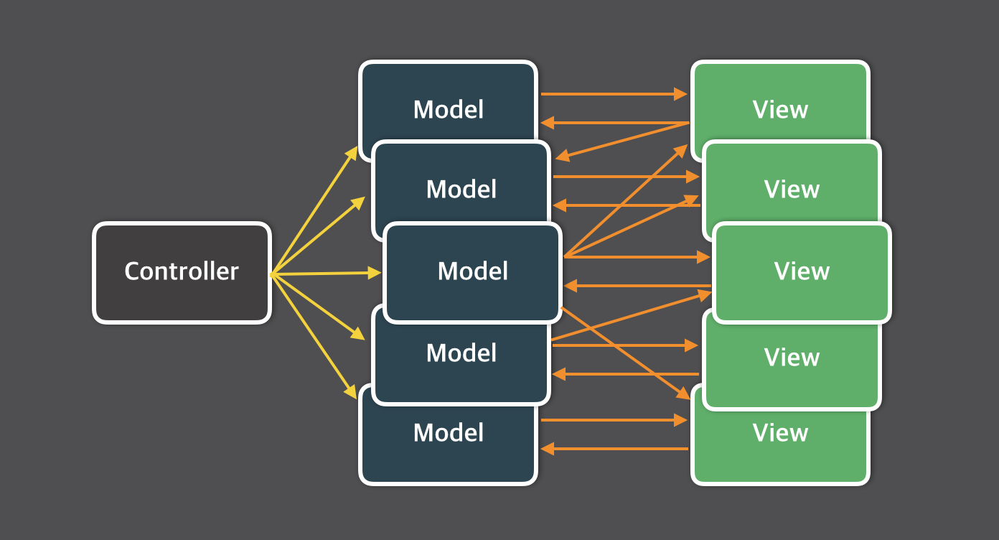

#### 들어가며

지금은 react에서 데이터 관리를 할 때 redux를 쓰는 게 당연시되고 있는데요. redux가 허공에서 뚝 떨어진 패키지는 아닙니다. 2014년 facebook이 개발자 컨퍼런스에서 flux 디자인 패턴과 그 패턴을 실제로 적용한 같은 이름의 패키지를 발표했고, 그 후 댄 아브라모브Dan Abramov라는 개발자가 flux 패턴을 이용한 새로운 패키지인 redux를 발표하게 된 것이죠.

  <iframe class="iframe-content" src="https://www.youtube.com/embed/nYkdrAPrdcw?start=621" frameborder="0" allow="accelerometer; autoplay; encrypted-media; gyroscope; picture-in-picture" allowfullscreen></iframe>

Facebook F8 Conference 2014

#### Flux 출현 배경: 기존 MVC 모델의 한계

그렇다면 facebook은 어째서 flux 패턴을 만들게 된 걸까요? 요약하자면, 대규모 어플리케이션에서 보다 일관된 데이터 관리를 하기 위해서였습니다.

기존의 어플리케이션 환경에서 보편적으로 사용되는 패턴은 MVC였습니다. Model에 데이터를 정의해 두고, Controller를 이용해 Model 데이터를 생성 / 조회 / 수정 / 삭제(CRUD)하고, 변경된 데이터는 View에 출력되면서 사용자에게 전달됩니다.

Flux 공식 이미지 | 단순 MVC 패턴

이 패턴의 문제점은 어플리케이션의 규모가 커질수록 데이터 흐름의 복잡도가 무지막지하게 늘어난다는 것이었습니다. 예를 들어 칼럼 게시판을 만든다고 칩시다. 이 게시판 UI의 가장 큰 특징은 자신이 최근에 남긴 댓글이 우측 사이드바에 실시간으로 떠오른다는 것입니다.

만일 유저 A가 새 글을 쓰고 유저 B가 댓글을 작성했는데, 마음이 바뀐 A가 글을 5분만에 삭제했다면 어떻게 될까요? 공교롭게도 B가 사이트를 떠나지도 않고 새로고침도 하지 않은 채 창을 내버려뒀다면, 이 게시판은 어떻게 B의 댓글이 지워졌음을 반영할 수 있을까요? 게다가, 사이트 헤더에 이 게시판의 전체 댓글 수를 실시간으로 집계하는 카운터가 달려 있다면?

Flux 공식 이미지 | 복잡한 MVC 패턴

MVC 패턴은 데이터의 변경 사항을 신속하게 전파하기가 어렵습니다. 모델이 늘어날수록 전파해야 할 대상도 함께 늘어나기 때문인데요. 하나의 포스트가 삭제되면 포스트에 딸려 있던 각 댓글도 함께 삭제될 텐데, 이때 댓글을 잃어버린 각 유저의 댓글 사이드바나 사이트 헤더의 전체 덧글 카운터에도 변경사항이 전파되어야 합니다. MVC 패턴에서는 사이드바와 헤더의 데이터를 관리하는 모델들이 포스트 모델을 항상 주시하게 만들게 될 거고 코드는 함께 복잡해질 겁니다. 더 커다란 문제는 각 모델에서 발생한 이벤트가 어플리케이션 전체로 무차별적으로 번져나갈 때 어떤 변화가 일어날지 예측할 수가 없다는 데에 있습니다.

#### Flux 패턴 살펴보기

facebook은 이 문제를 해결하기 위해 flux라는 패턴을 만들었습니다. Model이 View를 반영하고, View가 Model을 변경하는 양방향 데이터 흐름에서 벗어나 단방향으로만 데이터를 변경할 수 있도록 만든 건데요.

Flux 공식 이미지 | Flux 패턴

우선 '단방향 데이터 흐름'이 어떻게 이루어지는지를 알아봅시다.

###### Action / Action Creator

액션은 데이터의 상태를 변경할 수 있는 명령어 카드와 같습니다. 액션 생성자는 새로 발생한 액션의 타입과 데이터 페이로드를 액션 메시지로 묶어 디스패쳐로 전달합니다.

###### Dispatcher

디스패쳐는 액션 메시지를 감지하는 순간 그것을 각 스토어에 전달합니다. 전달은 콜백 함수로 이루어지며, 등록되어 있는 모든 스토어로 페이로드를 전달할 수 있습니다. 이때 스토어가 서로를 의존하고 있다면 (학생의 개인정보를 담은 스토어와 모든 학생의 수학 점수만을 담은 스토어를 예로 들 수 있겠군요) 특정 스토어가 업데이트되기를 기다리게 해주는 `waitFor()`를 사용할 수 있습니다.

###### Store (Model)

스토어는 어플리케이션의 상태와, 상태를 변경할 수 있는 메서드를 가지고 있습니다. 어떤 타입의 액션이 날아왔느냐에 따라 메서드를 다르게 적용해 상태를 변경하게 됩니다.

###### View

React에 해당되는 부분입니다. 컨트롤러 뷰는 스토어에서 변경된 데이터를 가져와 모든 자식 뷰에게 데이터를 분배합니다. 데이터를 넘겨받은 뷰는 화면을 새로 렌더링합니다.

#### 그래서 결과는...

flux의 단방향 데이터 흐름을 만화로 보여준 멋진 포스팅이 있습니다. 이 만화를 참고하시면 좋겠군요.

<a href="https://bestalign.github.io/2015/10/06/cartoon-guide-to-flux/" target="_blank" rel="noopener noreferrer">[번역] Flux로의 카툰 안내서 | bestalign's dev blog</a>

다시 한번 글로 요약하자면 흐름은 다음과 같습니다.

>
> - 선생님이 뷰를 통해 A군의 수학 점수를 입력한다.
>
> - 뷰는 데이터를 업데이트하기 위해 액션 생성자를 호출한다.
>
> - 액션 생성자는 수학 점수를 업데이트하기 위한 액션 타입과 입력된 값을 묶어 디스패쳐로 전달한다.
>
> - (예: `actionType: 'UPDATE_MATH', payload: ['A', '75']`)
>
> - 액션 메시지를 감지한 디스패쳐는 액션을 `mathStore`와 `studentStore`에 전달한다.
>
> - 각 스토어는 액션 타입에 따라 상태를 변경한다. 만일 `studentStore`가 `mathStore`를 의존하고 있다면, 콜백 체인을 통해 `mathStore`가 먼저 업데이트되기를 기다렸다가 `studentStore`를 업데이트할 수 있다.
>
> - 스토어가 업데이트를 마치면 이를 감지한 컨트롤러 뷰가 자식 뷰에게 새로운 값을 분배한다.
>
> - 마지막으로 뷰는 새로운 값으로 화면을 렌더링한다.

자! 어플리케이션엔 다시 평화가 찾아왔습니다. 데이터 흐름은 한 방향으로 강제되고, 모든 상태는 스토어에 모여 있으므로 변경 사항을 여러 컴포넌트로 전달하기도 쉽습니다.

#### Flux != Redux

오늘날엔 Redux가 상태 매니저로 널리 사용되고 있습니다. 이렇게 해피엔딩이었다면 좋았겠지만... 최근엔 Redux가 기능에 비해 너무 과한 타이핑을 요구한다는 불만이 나오고 있죠. 많은 개발자들이 Redux를 대체할 더 간단한 솔루션을 찾고 있고, React도 이런 요구에 발맞추기 위해 16.3 버전부터 Context API를 제공하고 있습니다. 그런데 왜 원조 격인 flux 대신 Redux가 더 흥했던 걸까요? 그리고 왜 flux 컨셉을 따르고 있는데도 사람들은 왜 Redux를 벗어나려고 하는 걸까요?

Redux가 널리 쓰인 이유는 단순합니다. flux 패키지는 실제 프로젝트에 적용하도록 만들어졌다기보단 flux 패턴 컨셉을 시연한 수준이었고, Redux는 이 컨셉을 진지하게 적용한 프로젝트였기 때문입니다.

왜 Redux가 모두에게 만족스럽지 않은가, 하는 문제는 조금 복잡합니다. 우선 **Redux는 flux 패턴을 그대로 구현한 게 아닙니다.** flux 패턴과 함수형 프로그래밍, 불변 데이터 컨셉을 적절히 버무려서 만들어졌습니다. 핵심 철학에 있어서 flux와 다른 점이 많습니다.

**Redux에는 디스패쳐 개념이 없습니다.** 간단히 말해서 "리듀서"가 "디스패쳐 + 스토어"의 기능을 담당합니다. (Redux의 스토어는 어플리케이션의 유일 객체로서 뷰 전체를 Wrapping하는 역할만 맡습니다) 이벤트 에미터EventEmitter로 작동하는 디스패쳐를 생략하고 리듀서가 각 액션 타입에 대한 메서드를 순수 함수Pure Function로 구현하는 편이 더 낫다는 입장인데요. 여기서 한 걸음 더 나아가 Redux는 리듀서가 관리하는 모든 상태를 immutable하도록 설정합니다. 업데이트된 값은 기존의 상태에 overwrite되는 게 아니라 새로운 객체로 복사되어 리턴됩니다. **각 리듀서는 서로를 의존할 수 없고 완전히 고립되어 있습니다.**

두번째로, 위에서 언급했듯 **Redux의 스토어는 싱글턴 패턴을 따릅니다.** flux의 스토어가 각자의 상태만 간직한 채 여럿으로 공존했던 것과 달리, Redux는 상태를 지니는 역할을 리듀서로 넘긴 뒤 모든 종류의 리듀서가 단 하나의 스토어에 묶이도록 설계했습니다. 각 뷰가 자신이 필요한 스토어만 각각 접근할 수 있었던 flux와 달리 Redux는 무조건 싱글 스토어를 통해 각 리듀서에 접근할 수 있습니다.

불변 데이터 컨셉으로 무결성을 보장하고 side-effect 없이 상태를 업데이트하도록 강제한 것은 분명 Redux의 장점입니다. 하지만 이를 위해 디스패쳐를 이용한 유연한 업데이트 방식을 포기하고, 중앙집중형 스토어를 구현함으로써 뷰가 데이터에 접근하는 방식을 무척 번거롭게 만든 것도 사실이죠.

#### Context API, Redux의 대안이 될 수 있을까?

Context API는 React 내부에 구현된 상태 관리 툴입니다. Redux보다 훨씬 작은 규모로, 각 컴포넌트마다 개별적으로 운용할 수 있다는 장점이 있습니다. 이번 포스팅은 여기서 마치고, 다음 포스팅에서는 Context API를 이용해서 어떻게 상태 관리를 할 수 있을지 알아보겠습니다.

#### 참고 자료

<a href="https://facebook.github.io/flux/" target="_blank" rel="noopener noreferrer">Flux 공식 사이트</a>

<a href="https://www.quora.com/Why-is-Redux-more-popular-than-Facebook-Flux" target="_blank" rel="noopener noreferrer">"[Quora] 왜 Redux가 Flux보다 대중적인가요?"</a>

<a href="https://rea.tech/singletons-suck-aka-flux-to-redux/" target="_blank" rel="noopener noreferrer">싱글턴은 쓰레기다(a.k.a Redux)</a>

