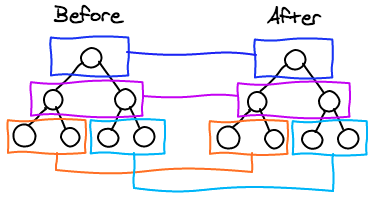

#### 들어가며

react는 스스로 어떻게 일하는지 잘 드러내지 않는 도구입니다. 쓰기는 쉽지만 깊게 이해하기는 까다롭죠. 어쨌든 효율적인 설계를 위해선 내부를 파악해야 합니다. 이번 시간엔 react가 view를 어떻게 그리는지, 변경사항은 어떻게 업데이트하는지, 그 원리를 알아보겠습니다.


#### Reconciliation: 재조정

(참고: <a href="https://reactjs.org/docs/reconciliation.html" target="_blank" rel="noopener noreferrer">Reconciliation - React</a>)

이미 react 공식 문서에서 소개하고 있는 내용인데요. 전체 DOM 트리를 탐색하고 비교하는 일반적인 알고리즘이 있지만, 이 알고리즘은 O(n^3)의 복잡도를 갖습니다. 하지만 react는 두 가지 힌트를 이용해 복잡도를 O(n)까지 줄이는 데 성공했습니다.

> - 부모 노드의 타입이 다르면 자식 노드는 비교하지 않는다.
> - 노드에 key를 부여하면 일일이 탐색하지 않고도 접근할 수 있다.

공식 문서의 문장을 그대로 옮겨오지 않고 제 나름의 말로 다시 써봤습니다. 저게 무슨 소리지? 싶을 수 있지만 예제를 보시면 이해하기 쉬울 겁니다.


###### 부모 노드의 타입이 다르면 자식 노드는 비교하지 않는다

트리 탐색 알고리즘을 많이 접해보신 분들은 아시겠지만, 트리를 탐색하는 데에는 크게 두 가지 방법이 있습니다. 너비 우선 탐색과 깊이 우선 탐색인데요. 너비 우선 탐색은 같은 깊이에 있는 노드를 전부 파악한 뒤 그 다음 자식 세대의 노드를 순차적으로 파악하는 방식을 말합니다. 반면 깊이 우선 탐색은 한 노드의 최하단 깊이까지 모두 탐색한 뒤 다음 노드를 파악해가는 방식을 말합니다.

react는 DOM 트리를 **level-by-level**로 탐색합니다. 너비 우선 탐색의 일종이라고 볼 수 있죠.



<p class="caption">기존 서브트리와 같은 위치의 서브트리를 비교합니다</p>

그런데 DOM 트리는 보통 트리 구조와는 다른 독특한 특징이 있습니다. 각 HTML 태그마다 자기만의 규칙이 있어서 그 아래 들어가는 자식 태그가 한정적이라는 것입니다.

예를 들어 `<ul>`이나 `<ol>` 태그 바로 밑에는 `<li>` 태그만 담기게 되죠. ``나 `<iframe>`이 담길 일은 없습니다. 그리고 만일 `<div>` 태그 안에 `<button>` 태그가 있었는데 `<div>`가 `<span>` 태그로 바뀐다면, 설령 자식 태그가 그대로라 할지라도 `display: block` 규칙이 무너지기 때문에 렌더링 결과물은 어차피 달라지겠지요. 이런 점을 생각했을 때, 부모 태그의 타입이 바뀌는 순간 그 아래 모든 자식 태그들은 굳이 탐색할 것 없이 새로 렌더링해버리는 편이 더 효율적인 셈입니다.

공식 홈페이지 예제입니다.

```html
<div>
  <Counter />
</div>
⬇︎
<span>
  <Counter />
</span>
```

<br />

위의 `<div>` 루트 노드가 아래 `<span>` 으로 바뀌면, 자식 노드인 `<Counter />` 컴포넌트는 완전히 해제되고 state 또한 파괴됩니다.

컴포넌트나 DOM 요소가 타입만 바뀌지 않는다면 react는 최대한 렌더링을 하지 않는 방향으로 최소한의 변경 사항만 업데이트 합니다. 이게 가능한 이유는 react가 실제 DOM을 조작하는 게 아닌 virtual DOM을 사용하기 때문입니다. 간단히 말해 virtual DOM은 실제 DOM을 생성할 때 필요한 정보들을 담은 객체인데요. 업데이트 할 내용이 생기면 virtual DOM 내부의 프로퍼티만 수정한 뒤, 모든 노드에 걸친 업데이트가 끝나면 그때 단 한번 실제 DOM으로의 렌더링을 시도합니다. 이렇게 함으로써 DOM 조작에 따른 오버헤드를 최대한 줄일 수 있게 된 거죠.

```javascript
// virtual DOM의 예
// 변경사항이 있으면 실제 DOM을 조작하지 않고 virtual DOM 객체 프로퍼티만 변경합니다
// render는 모든 프로퍼티 변경이 끝난 뒤에 전체를 취합해 한번만 이루어집니다
function render(count)  {
    return h('div', {
        style: {
            textAlign: 'center',
            lineHeight: (100 + count) + 'px',
            border: '1px solid red',
            width: (100 + count) + 'px',
            height: (100 + count) + 'px'
        }
    }, [String(count)]);
}
```

<br />

(참고: <a href="https://github.com/Matt-Esch/virtual-dom" target="_blank" rel="noopener noreferrer">GitHub - Matt-Esch/virtual-dom: A Virtual DOM and diffing algorithm</a>)

###### 노드에 key를 부여하면 일일이 탐색하지 않고도 접근할 수 있다

리액트는 자식 엘리먼트를 비교할 때 이전 목록과 다음 목록의 순서에 따라 업데이트 여부를 결정합니다.

```html
<ul>
  <li>first</li>
  <li>second</li>
</ul>
⬇︎
<ul>
  <li>first</li> {/* 그대로군. */}
  <li>second</li> {/* 그대로군. */}
  <li>third</li> {/* 추가됐네. 새로 렌더링! */}
</ul>
```

<br />

위의 예제를 보시면, react는 기존 `<ul>` 과 새 `<ul>` 을 비교할 때 자식 노드를 순차적으로 비교하면서 바뀐 점을 찾습니다. 마지막 위치에만 새 노드가 추가된다면 react는 우리가 원하는 대로 바뀐 부분만 업데이트하게 됩니다. 하지만, 목록의 첫 부분에 뭔가 추가된다면 어떨까요? 사람이 보기엔 나머지 노드가 그대로인 것처럼 보여도, react는 목록 전체가 바뀌었다고 받아들입니다.

```html
<ul>
  <li>first</li>
  <li>second</li>
</ul>
⬇︎
<ul>
  <li>zero</li> {/* first가 zero가 됐군. 새로 렌더링! */}
  <li>first</li> {/* second가 first가 됐군. 새로 렌더링! */}
  <li>second</li> {/* 추가됐네. 새로 렌더링! */}
</ul>
```

<br />

이는 굉장한 낭비를 불러올 수 있습니다. 그래서 react는 반복되는 엘리먼트에게 key를 부여하도록 하죠. 그러면 react는 노드의 순서가 바뀌어도 기존의 것이 그대로라는 걸 알아보고 새로 렌더링하지 않습니다. key는 서브트리 단위로 고유하기만 하면 됩니다.

```html
<ul>
  <li key="a">first</li>
  <li key="b">second</li>
</ul>
⬇︎
<ul>
  <li key="c">zero</li> {/* 추가됐네. 새로 렌더링! */}
  <li key="a">first</li> {/* 아까 그 녀석이군. 순서만 바꾸자. */}
  <li key="b">second</li> {/* 아까 그 녀석이군. 순서만 바꾸자. */}
</ul>
```

<br />

#### 뭐니뭐니해도 Reconciliation은 피하는 게 상책

아무리 react의 재조정 알고리즘이 훌륭해졌다고 하지만... O(n)도 여전히 큽니다. 노드를 백만 개 가까이 다뤄야 한다면 말이죠. 그래서 react에서는 컴포넌트 라이프 사이클에 렌더링을 차단할 수 있는 옵션을 제공하고 있습니다. 바로 `ShouldComponentUpdate` 함수입니다.

(참고: <a href="https://reactjs.org/docs/react-component.html#shouldcomponentupdate" target="_blank" rel="noopener noreferrer">React.Component – React # ShouldComponentUpdate</a>)

이 함수는 컴포넌트가 업데이트 할지 말지를 boolean 값으로 결정하게 해 줍니다. 기존 props와 업데이트 될 state를 비교한 뒤 컴포넌트 업데이트 여부를 결정하게 하는 거죠. 만일 개발자가 "이 컴포넌트는 절대 업데이트 될 일이 없을 거야"라고 생각된다면, 그냥 `return false` 를 지정하면 됩니다. 그러면 해당 컴포넌트는 어떤 경우에도 업데이트되지 않죠.

업데이트 여부를 어떻게 결정해야 할지 까다롭다면, `PureComponent` 혹은 `React.memo` 를 사용할 수도 있습니다. `PureComponent`는 개발지를 대신해 `ShouldComponentUpdate`를 어떻게 할지 미리 결정해 놓은 컴포넌트입니다. '얕은 비교 shallow-compare'를 통해 기존 값과 새 값이 원시 값의 경우 동일하거나, 객체 프로퍼티 값의 경우 레퍼런스가 동일하다면 업데이트를 수행하지 않습니다. `React.memo`는 함수형 컴포넌트에서도 `PureComponent` 의 효과를 낼 수 있도록 도와주는 HOC입니다.

```javascript
// PureComponent

class Student extends React.PureComponent {
    // 나머지 사용법은 기존 컴포넌트와 같습니다
}

// React.memo
const Student = React.memo(() => (<div>hello</div>))

```

<br />

###### PureComponent를 소용 없게 만드는 잘못된 습관

위에서 `PureComponent`는 기존 값과 새 값의 레퍼런스를 비교한다고 말씀드렸죠. 이 점을 명심하지 않으면 비효율적인 코드를 만들 위험이 있습니다.

```javascript
class Item extends React.PureComponent {
    ...
}

class List extends React.Component {
    ...
    render() {
       return (
       		<div>
           		<Item item={this.state.item} deleteItem={() => this.deleteItem()} />
           </div>
       )
    }
}
```

이런 코드가 있다고 가정합시다. 여기서 코드를 비효율적으로 만드는 주범은 무엇일까요? 바로 `deleteItem` props로 전달되는 함수입니다. props에 익명함수를 전달하게 되면, 익명함수는 전달될 때마다 다른 레퍼런스를 갖게 됩니다. 그러면 `PureComponent` 인 `Item`은 실상 계속해서 같은 함수가 전달되고 있음에도 레퍼런스 비교를 통해 다른 함수가 들어왔다고 착각하게 되고, 불필요한 업데이트를 거듭하게 되죠. 이는 함수뿐만 아니라 객체를 전달할 때도 마찬가집니다.

```javascript
<Item item={{
            kind: 'article',
            length: 3,
            etc: result.item,
            ...
           }} deleteItem={() => this.deleteItem()} />
```

지금 보시면 `item` props에서 즉석에서 객체를 만들어 전달하고 있죠. 이 객체는 따로 변수에 할당된 것이 아니기 때문에 만들어질 때마다 새로운 레퍼런스를 갖게 됩니다. 불필요한 업데이트를 거듭하는 원인이 됩니다.

#### 마치며

react의 업데이트 알고리즘을 살펴봤습니다. 최적화는 여러 방면의 배경 지식을 갖추고 접근해야 이뤄낼 수 있다는 걸 느낀 시간이었습니다. 이외에도 코드 스플리팅을 하거나, 엄청나게 많은 노드를 다룰 때 값을 lazy하게 나누어서 불러들이는 스킬 등이 필요할 것입니다.

(참고: <a href="https://github.com/nhnent/fe.javascript/wiki/March-20---March-24,-2017-(2)" target="_blank" rel="noopener noreferrer">nhnent/fe.javascript | React 렌더링과 성능 알아보기</a>)

