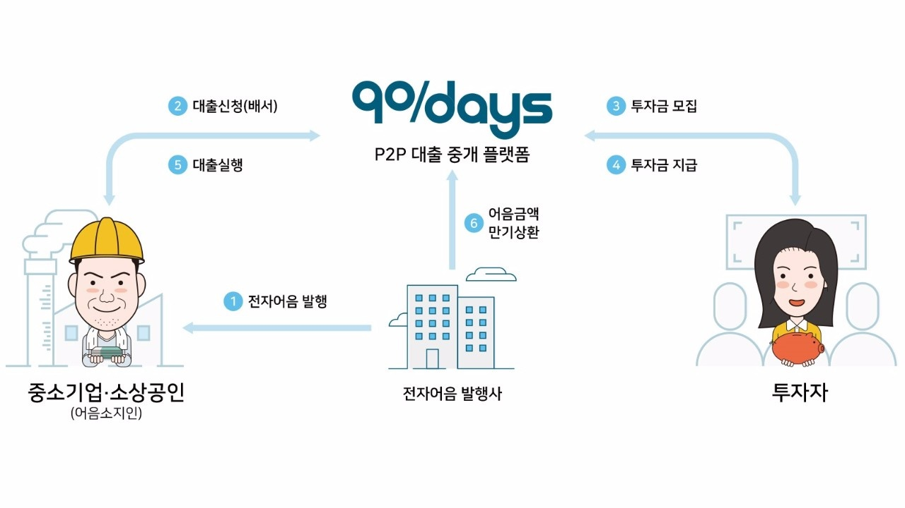

#### 들어가며

안녕하세요, 너무 오랜만에 인사드리게 됐네요. 블로그를 써야지 하면서도 시간이 너무 오래 걸린 것 같아 죄송스럽습니다ㅜㅠ... 이제야 다시 글을 쓰게 된 이유는 제목에서도 밝혔듯이 우여곡절 끝에 취업을 했기 때문이구요. 이제는 단순히 개발 배우는 학생에서 한 단계 더 나아가서 자기 커리어를 관리하는 전문 개발자가 되고 싶어졌네요.

#### 한국어음중개?

한국어음중개 비즈니스 흐름도

 

<a href="https://90days.kr" target="_blank" rel="noopener noreferrer">한국어음중개</a>는 중소기업 / 소상공인들이 전자어음 할인을 P2P 투자 플랫폼에서 받을 수 있도록 도와주는 금융 스타트업 회사입니다. 아마 이 글을 읽으시는 대부분이 '어음'이나 '어음할인'의 개념이 무엇인지 헷갈리실 수도 있다고 생각이 드는데요. 잠깐만 간단히 짚고 넘어가도록 하겠습니다.

어음은 금전 지급을 약속하며 발행하는 지급 보증서입니다. 쉽게 말해 외상 증서와 같은데요. 신속한 거래가 필요하지만 당장 활용할 유동자산이 없을 때, 일정 기한 뒤에 현금을 갚겠다는 내용의 어음을 대신 거래하는 것입니다. 차용증이나 지불각서에 비해 법적 효력이 명확한 편이라 기업 간에는 어음을 이용한 거래가 활발한 편입니다.

하지만 어음은 순전히 발행인의 신용만으로 거래되는 것이라 부도가 날 경우 아무도 보증해주지 않는다는 큰 위험을 안고 있습니다. 이를 관리/감독하기 위해 금융결제원이 전자어음 제도를 도입해 운영하고 있는데요. **한국어음중개는 기업이 전자어음을 이용한 어음할인을 받고자 할 때 P2P 투자자와 기업을 연결시켜주는 역할을 맡고 있습니다.**

*(어음할인: 어음을 소지한 자가 지급 기한보다 빨리 현금을 확보하고 싶을 때, 제 3자에게 어음을 담보로 대출을 받는 것. 이때 대출금에서 할인료라는 명목의 수수료를 떼이기 때문에 '할인'이라는 표현이 생김)*

기업이 전자어음을 담보로 플랫폼에 할인 신정을 하면, 플랫폼은 P2P 투자자들을 모집해 대출금 투자를 받습니다. 투자금 모집이 완료되면 기업은 대출을 받고, 플랫폼은 전자어음 발행사로부터 어음금액을 상환받은 뒤 투자자들에게 원리금을 일시에 지급합니다.

#### 올해 목표

한국어음중개의 올해 목표는 전자어음만을 다루도록 설계된 기존 코드 베이스를 보다 유연한 CMS 서비스 구조로 바꾸는 것입니다. 여기서 저는 Node/프론트엔드 개발자로서 JSP 기반의 레거시 코드를 React/GraphQL 기반으로 재작성하는 역할을 맡게 되었습니다. 4월 말까지 기초 작업을 마무리한 뒤에는 전자어음 외에 보다 범용적인 채권 상품을 다룰 수 있는 열린 플랫폼으로 확장하는 과정까지 진행할 예정입니다.

#### 주요 스택

리뉴얼 플랫폼은 <a href="https://aws.amazon.com/ko/ecs/" target="_blank" rel="noopener noreferrer">AWS  ECS</a>와 <a href="https://aws.amazon.com/ko/fargate/" target="_blank" rel="noopener noreferrer">Fargate</a>를 함께 사용해 서버리스 도커 오케스트레이션 서비스를 구현했습니다. 도커 이미지를 업로드하면 EC2 인스턴스 없이 배포가 이루어지고, 분산 환경 및 무중단 배포가 구현됩니다.

프로덕션 배포는 <a href="https://aws.amazon.com/ko/codepipeline/" target="_blank" rel="noopener noreferrer">AWS CodePipeline</a>를 이용합니다. GitHub 저장소에 새 커밋이 푸시되면 Webhook 트리거를 시작으로 도커 빌드 및 ECS 배포까지 자동으로 이루어집니다. 

여기에 사용된 모든 리소스는 <a href="https://aws.amazon.com/ko/cloudformation/" target="_blank" rel="noopener noreferrer">CloudFormation</a> 템플릿으로 관리합니다. CloudFormation은 한마디로 **'AWS를 만드는 AWS'**입니다. yaml 파일로 작성한 템플릿을 입력하기만 하면 내가 원하는 모든 AWS 인프라를 자동으로 빌드해줍니다. 언젠가 이번 프로젝트를 만들면서 사용한 모든 AWS 서비스들을 소개해드리고 싶네요.

그 외에도 그동안 새롭게 손댄 분야가 정말 많습니다. <a href="http://medium.com/bucharestjs/upgrading-a-create-react-app-project-to-a-ssr-code-splitting-setup-9da57df2040a" target="_blank" rel="noopener noreferrer">Create-react-app을 eject하지 않고 서버 사이드 렌더링으로 구동하기</a>가 가장 놀라운 경험이었습니다. 기존 인프라와 세션을 공유하기 위해 서버 사이드 렌더링이 반드시 필요한 상황이었는데, 이걸 구현해내면서 많은 것을 배웠던 것 같습니다. 여기에 관해선 따로 포스팅을 남길 생각입니다.

#### 아무튼

오늘은 여기까지구요! 종종 블로그 들러주시는 분들께 항상 감사드리고 있습니다. 차근차근 다시 포스팅을 시작하려고 하시 기대해주세요!
