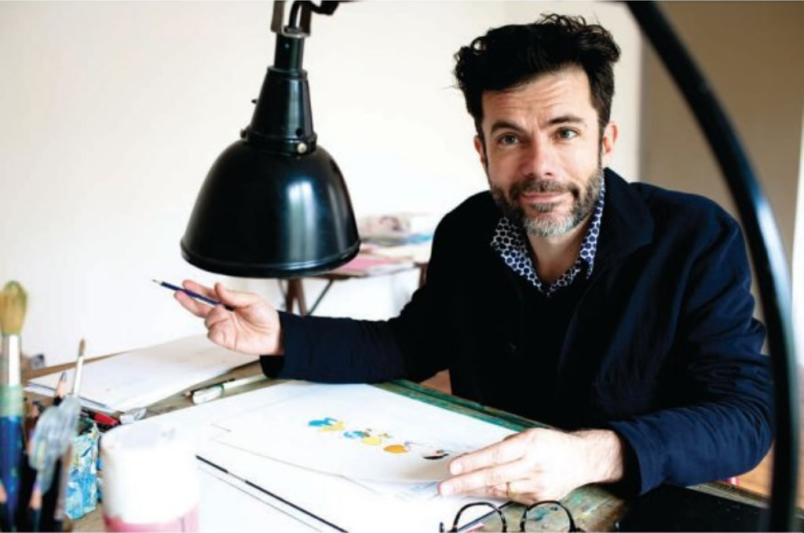
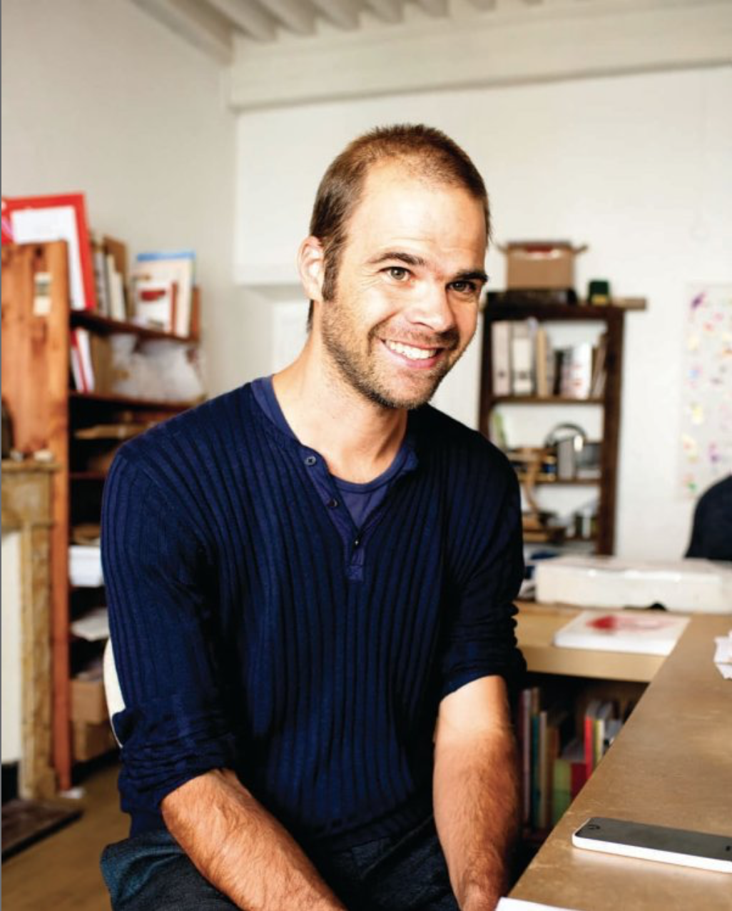

#### 읽기 전에

오랜 시간 소설을 써 온 내게 글쓰기란 큰 부담이 된 지 오래다. 후배들이 하나둘씩 문학상에서 상을 타는데, 나는 아무리 공모전에 투고를 해도 소식이 없으니 내가 글을 쓰는 방향이 잘못된 거라고 단정짓게 된다.

나의 첫번째 글은 초등학교 3학년 때 썼던 <곰돌이 푸> 동화책이었다. 당시에는 내가 잘 쓰고 있는지, 아닌지는 전혀 고민하지 않았다. 그저 이야기가 펼쳐진다는 사실이 즐거워서 종이를 채워나갔던 기억이 난다. 지금은 많이 달라졌다. 한 글자 한 글자를 써나갈 때마다 내 안의 수많은 검열과 마주친다. '이건 틀렸어. 이런 소재는 별로야. 내용 전달이 안 될 게 뻔해.' '창의성'이니 '상상력'이니 하는 단어는 오히려 그런 힘들과 멀어졌을 때 절실해지기 시작했다. 대학을 졸업하면서 글쓰기와 멀어질 수 있는 기회는 얼마든지 있었다. 그런데도 내가 이 길을 포기하지 않은 이유는 무엇이었을까? 나는 스스로에게 틈날 때마다 이런 질문을 했다. 왜 계속해서 글을 쓰려는 거지? 그동안 들인 시간이 아까워서? 주변 사람들의 기대에 부흥하기 위해서? 솔직히 말하자면 아직도 정답은 모르겠다. 나는 남들이 침범하지 못할 나만의 공간을 오래 전부터 갖고 싶어 했을 뿐이다. 무의미하게 흘러가는 삶 속에서 어떤 특별한 느낌을 모아 가치 있는 것을 만들어내고 싶다는 욕심이 있다. 예전에는 이런 욕심이 글을 쓰는 이유 자체라고 믿었다. 하지만 오랜 시간이 지나서야 깨달았다. 내가 목적과 수단을 구분하지 못해왔다는 사실을 말이다. 그래서 최근 몇 년 간 내 관심사는 프로그래밍과 그림 그리기로 넓어졌다. 가치 있는 걸 만들고 싶다는 목적을 이루기 위한 다른 여러 수단을 꿈꾸기 시작한 것이다.

내가 <유럽의 그림책 작가들에게 묻다>라는 책을 골랐던 건 "글쓰기가 아닌 다른 방식으로 창작하는 사람들은 어떤 고민과 노하우를 지니고 있을까?" 하는 호기심 때문이었다. 잡지사 편집장 출신인 저자도 나와 비슷한 목마름을 느껴서 이 책을 기획하게 되었다고 한다. 아무래도 한국인들은 스스로 '창의력'과 '상상력'이 부족하다는 열등감을 가지고 있으니까, 유럽의 예술가, 그중에서도 프랑스, 그중에서도 아동 일러스트를 그리는 작가라면 '창의력'을 자유롭게 발휘하는 방법을 확실하게 배울 수 있으리라고 믿는 것이다.

책은 10명의 그림책 작가를 차례차례 인터뷰하는 방식으로 꾸려져 있다. 각 작가의 작업실이나 아틀리에 사진을 싣고, 작가들에게 어떻게 작가가 되었는지, 어떤 식으로 창의력을 발휘하는지를 질문하고 있다.

#### 프랑스 사람에게도 쉬운 일이 아닌 창의력

인상깊었던 멘트가 여럿 있는데, 몇 가지만 추려서 얘기해보고 싶다.

> 자신의 취향을 이해하고, 자기만의 느낌을 찾는 일은 프랑스 사람에게도 쉬운 일은 아니랍니다.
>
> -올리비에 탈레크

책을 읽을 당시에는 표시하지 않았는데 시간이 지나면서 자꾸 생각이 났다. 한국인으로서의 열등감을 가지고 있는 저자의 감정이 느껴져서일까. 책의 목적이 나의 바깥을 향해 있는 창조성의 갈망을 나의 내면으로 돌리게끔 하는 데 있다고 생각했기 때문에, 많은 내용을 함축하고 있는 글귀로 여겨졌다.

넓게 생각해보면, '창의성의 빈곤'이라는 주제에는 언제나 교육 시스템에 대한 비판과 함께 한국 문화에 담긴 결함을 꼬집고 선진국의 사례를 살피는 기획이 뒤따르곤 했다. 이는 7-80년대 산업화 시기 선진국을 따라잡으려 나라 전체를 개조하려 했던 정부 선전의 구조와 닮아 있다. 해결하기 어려운 과제에 부딪치면 '개발도상국의 조바심'을 작동시켜 타인에게 해답을 얻으려고 동분서주하는 것이다. 물건을 사기 전에 리뷰를 체크하고, 게임을 하기 전에는 공략집을 먼저 살핀다. 나보다 앞서 성공한 사람의 사례를 시행착오 없이 내게로 이식하려는 욕망이 있다. 이런 현상을 저자는 "자기만의 느낌을 가져 볼 기회 없이 성장해 한 개로 정해진 정답을 손에 쥐어야 안심하는 한국적인 세계관"이라고 표현한다.

하지만 올리비에 탈레크는 작가가 창조성을 발견하는 과정이 국민성에 따라 차이가 나지는 않는다고 말한다. 그의 소탈한 고백이 내게는 잠깐의 위로로 다가왔다. 나는 내 글쓰기가 결실을 맺지 못한 게 노력이 부족해서라는 사실을 인정하지 못해 불행했었다. 내게 주어진 조건이 불리하다고 믿으며 열심히 퇴고하지도 않았다. 상상 속의 완성된 소설에 비해 초고는 형편이 없어 쳐다보려고 하지도 않았다. 이제는 자기 검열이 너무 심해져서 글쓰기로 나를 표현한다는 게 어떤 느낌인지도 잊어버린 기분이다. 어떻게든 마음을 다잡고 소설을 쓰려고 하지만 거짓말만 늘어놓는 기분이 들어서 한 글자도 진행시킬 수가 없다.

그럼에도 나는 계속해서 무언가를 만들기를 멈추지 않는다. 뭐라도 기록하지 않으면 삶이 무의미하게 흩어져버릴까 봐 두려워서일까. 글쓰기가 힘들어진 요즘엔 만화를 그리고 있다. 그림 실력도 별로고 아직도 무얼 말하고 싶은지 모호하지만 멈추지 않으려고 노력 중이다. 그림을 그릴 때면 글쓸 때와는 다르게 내면에 있는 목소리를 곧장 퍼올릴 수 있다는 점이 좋다. 애초에 통제할 수도 없는 수많은 디테일 때문에 머리를 싸맬 필요도 없다. 그림을 좀더 오래 그리게 되면 어떻게 될지 모르겠지만 아직까지는 초심자의 행복을 즐기는 중이다.

#### 결점을 창작의 동력으로 바꾸는 힘

> *"대학 때 한 교수님이 해준 말씀이 있습니다. '네 작업 중 사람들이 좋아하지 않는 부분이 있다면 그것을 향해 가라. 그게 너다.' 자신 안에 숨어 있는 내밀한 목소리를 창작의 동력으로 바꾸는 힘, 대체될 수 없는 유일한 개성을 불어넣는 힘은 사실 우리의 결점 안에 있습니다."*
>
> -벵자맹 쇼

이 책 전부를 통틀어 가장 맘에 들었던 구절이다. 이 글을 읽기 전까지 결점이란 글을 쓰면서 지우거나 뛰어 넘어야 할 함정이라고 여겼다. 벵자맹 쇼도 대학에 입학할 때까지는 그림 그리기를 완벽하게 해내려고 발버둥쳤다고 한다. 하지만 어느 순간부터 남들의 기대에 부흥하기보다 자기가 원하는 그림을 그리기로 했다고 한다. 하지만 그게 말처럼 쉬운가? 우리는 이미 자기 단점을 지우고 장점을 극대화하는 전략에 익숙해져 있다. 자기 자신을 하나의 '컨텐츠'로 만들어내는 것이다. **SNS의 프로필로 인격을 표현하고 자기를 돋보이게 할 사진과 동영상을 끊임없이 생산하는 시대. 이런 시대에 고리타분한 '순수문학' 창작자가 여전히 많은 이유는 소설이 자기 인격을 컨텐츠화하기에 가장 진입장벽이 낮아 보이는 매체이기 때문이다(물론 그 기대는 순식간에 박살나고 말지만). 읽는 사람은 없지만 쓰는 사람은 너무 많다. 문학의 장은 이미 소통 불가능한 자아를 무제한으로 폭발시키는 수류탄 투척 연습장처럼 변해버렸다.** 그래서인지 나는 글을 쓸 때 소설 속에서 '징징거리는' 꼴이 보기 싫었다. 보다 완벽하게 구현된 스토리, 문장이나 아이디어를 보여주고 싶었다. 하지만 오히려 소설 속에서 나를 숨기려고 하면 할수록 소설은 더 기괴하고 알아보기 힘든 것으로 변해갔다. 이제는 내가 진짜로 원하는 게 뭔지 소설을 통해 표현하는 건 불가능해졌다는 느낌이 든다.

나의 결점은 부정적인 감정을 극도로 민감하게 느낀다는 것이다. 무시당한다는 느낌, 공격받는다는 느낌을 언제나 강렬하게 느낀디. 누군가를 좋아하게 되면 그 감정이 나를 박살낼 거라는 두려움에 사로잡힌다. 이루고 싶은 목표가 생기지만 실패할 경우를 먼저 상상하고, 그게 현실이 되면 일어날 일이 일어났다고 여겨 버린다. 그게 반복되면 부수기 힘든 무기력의 덫에 걸려든다. 인간관계든 일이든 공부든, 시작되기 전에 실망을 먼저 연습하고 더 이상 어떤 것도 느끼지 않으려고 한다. 감정이 요동치는 상태 자체가 너무나 고통스럽기 때문이다. 20대 내내 이렇게 행동했고, 이제는 고치기 힘든 성격이 되었다. 내가 스스로 원하는 것을 선택하는 일은 매우 드물어졌다. 일상생활의 대부분은 다른 사람이 원하는 일을 완수하는 것이 우선이 되어 있다. 많은 시간과 함께 혼자 남겨지면 끝없이 무기력해진다. 즐겨움이나 행복감을 느껴본 기억이 가물가물하다. 적극적으로 슬펐던 기억도 거의 없다. 내가 느끼는 감정의 대부분은 불안과 짜증과 약간의 폭소와 왠지 모르게 축 쳐져 있는 기분. 그게 전부다.

이야기가 다른 길로 샌 것 같지만, '나'의 경우를 하나의 케이스 삼아서 여러분들이 나름의 심리적 어려움을 극복했으면 하는 마음으로 쓴다. 과연 나는 이런 결점을 어떻게 '함께' 가져갈 수 있을까. 아니 그 전에, '왜' 그래야 할까? 결점과 함께 창작한다는 건 (심리적 결점과 더불어 기술적 결점까지) 나의 인격을 예술적 이해관계에 따라 우생학적으로 배제시키지 않는다는 것을 뜻한다. **결점과 함께 창작한다는 건 나의 창작물과 창작 과정을 컨텐츠로 만드는 데에 저항하는 것이고, 창작 활동이 자아-마케팅으로 연결되는 SNS 정글에서 스스로를 보호하는 비책이 된다.**

지금 내가 그리는 만화는 평소에 소설에서라면 쓸 일이 없었을 '날것의 내 목소리'를 담고 있다. 물론 인스타그램이나 페이스북에 틈틈이 업로드를 하고 있긴 하지만, 내 안의 내밀하고 부끄러운 모습을 그대로 담고 있다는 걸 알고 있는 상태라 그 작품들로 많은 사람의 주목을 받는다 한들 우쭐해질 일은 없을 것 같다. 그냥 내 가슴을 아프게 하는 한두 마디의 대화를 눈앞에 그려보고, 알 수 없는 감상에 젖어드는 경험을 하면서 모든 보상을 얻는다고 생각하고 있다. 맹목적인 소설 쓰기에서 거리두기를 시작하고 틈틈이 만화를 그리기 시작한 것. 이 책을 읽고 나서 내게 일어난 변화는 바로 이것이다.
